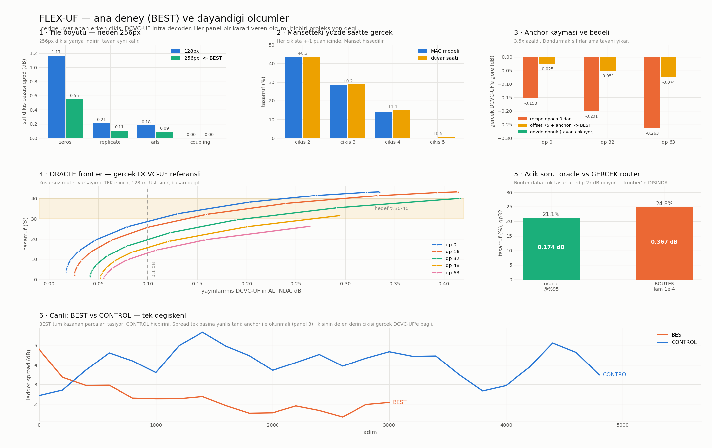

# FLEX-UF — ana deney raporu

İçeriğe uyarlanan erken çıkış, DCVC-UF intra decoder üzerinde. Her sayı ölçümdür;
oracle olan yerlerde ORACLE yazar, tek epoch olan yerlerde tek epoch yazar.

## Microsoft'un recipe'sine uyum — iddia değil, doğrulama

`scripts/verify_recipe.py` her maddeyi `~/DCVC/train_image.py` ile karşılaştırır ve
uyuşmazlıkta **hata verir**. Yeniden çalıştırılamayan bir "recipe'ye uyduk" iddiası
iddia değil, umuttur — ve bu proje zaten recipe'nin doğru kopyalanıp **yanlış
epoch'tan** uygulandığı bir vaka üretti.

| madde | durum |
|---|---|
| takvim satırları (8 satır) | karakteri karakterine aynı |
| takvim uzunluğu | 106 giriş, ilk `[0, 2e-4, 256, 256]`, son `[105, 1e-6, 512, 512]` |
| optimizer | AdamW, lr 1e-4 |
| gradyan kırpma | `clip_grad_norm_(0.1)`, non-finite batch atlanır |
| veri | `ImageFolder` + `get_training_lambdas` |
| QP seviyesi | `QP_LEVELS == DMCI.qp_num()` = 64 |
| encoder | DMCI ile birebir, 74 tensör |
| hyperprior + entropy modeli | 255 paylaşılan tensör, 0 farklı şekil |

**Bilerek eklenenler**, gizlenmeden: `--epoch_offset` (takvimi warm-start için doğru
yerinden okumak), `--anchor_weight`, `--new_lr_scale`, `--freeze_encoder`.

Takvim fonksiyonunun *metni* farklı — bizde docstring, onlarda yorum; bizde parantez,
onlarda satır devamı. Kontrol bunu bir ara **sapma diye işaretledi**; düzelttim, çünkü
yanlış alarm veren bir kontrolü insanlar görmezden gelmeyi öğrenir. Karşılaştırılan
değişmez artık takvim satırlarının kendisi.

Bir yan bulgu: Microsoft'un `train_image.py`'si Python 3.12 f-string sözdizimi
kullanıyor, 3.10'un ayrıştırıcısı dosyayı **açamıyor** bile. Buradaki rANS eklentisi
3.10 venv'ine karşı derlendi.

## Ana deney: BEST

Her parça ölçümle hak etti. CONTROL aynı konfigürasyon, eklemelerin **hiçbiri** yok —
çift "bu çalışıyor mu"yu "hangi parça yaptı"dan önce cevaplıyor.

| parça | kanıt |
|---|---|
| j=2, **256px tile** | saf dikiş qp63'te 0.0879 dB (128px: 0.1785), tavan aynı %43.4 |
| GridSeamRepair | ızgarayı biliyor, iç bölgede kendini kapatıyor; 256 skaler |
| ladder distillation | spread +1.60 vs kontrolün +4.34, anchor sadakatleri eşitken |
| derinliğe göre ölçekli adapter | kapasite açığı takip eder, **çıkış başına** faturalı |
| `--anchor_weight 10` | 58.6 dB sadakat vs 54.6 |
| öğrenilen ortak router | sabitleşmeyen tek router, decode'un %0.044'ü |

## Elde edilen — ORACLE, gerçek DCVC-UF referanslı

Aynı bitstream, aynı latent (encoder donuk, `max|diff| = 0`), fark yalnız sentez.

| qp | 0 | 16 | 32 | 48 | 63 |
|---|---|---|---|---|---|
| 0.1 dB altında tasarruf | %26.0 | %19.4 | %16.5 | %13.4 | %9.6 |

Kaynak: `wdec_j2_p128_grid` epoch 0 — **tek epoch, 128px tile**.

## Açık soru — ve şu an projenin en zayıf halkası

Yukarısı **oracle**: her tile'ın gerçek hatasını bilerek seçiyor. Gerçek router
sinyallerden tahmin ediyor ve **frontier'ın dışında**:

| qp32 | tasarruf | dB |
|---|---|---|
| oracle @%95 | %21.1 | 0.174 |
| GERÇEK router (λ=1e−4) | %24.8 | **0.367** |

Daha çok tasarruf edip orantısız daha çok kaybediyor — yanlış seçtiği tile'lar komşu
çıkışa değil uzağa gidiyor. λ ≥ 3e−4'te tamamen çöküyor (`dağılım [0,0,100,0,0,0]`).

Router v2 bunun üzerine kuruldu: entropy modelinin ölçekleri artık girdide (en yüksek
korelasyonlu sinyallerdi ve kullanılmıyorlardı), kapasite tile-başına MLP'ye taşındı
(orada bedava), hedef oracle etiketine **maliyet-duyarlı çapraz entropi**, ve çökme
kontrolü yardımcı kayıp yerine [Loss-Free Balancing](https://openreview.net/forum?id=y1iU5czYpE)
bias'ı — **oracle'ın kendi dağılımına** doğru, tekdüzeye değil.

Uyum **ayrılmış** tile'larda raporlanıyor. 144K parametreyle in-sample sayı istenen
yere tırmanır ve hiçbir şey ifade etmez; sinyal probe'unun ilk hâli tam olarak bunu
yapıp 1.000 raporladı.

## Dürüst kalan riskler

- **Hedefe ulaşılmadı.** %30-40 isteniyordu; kusursuz router varsayımıyla bile qp0'da
  %26, qp63'te %9.6.
- **`anchor_weight 10`'un tavana etkisi ölçülmedi** — koşusu checkpoint'ine varmadan
  kapatıldı. Anchor'ı sıkmak paylaşılan gövdeyi kısıtlıyor, ki sığ çıkışların ihtiyacı
  olan da o. BEST vs CONTROL birleşik etkiyi gösterecek; sonuç hayal kırıklığı olursa
  ilk şüpheli bu.
- **HEVC B/C/D ölçülmedi** — JVET katılımcı kimliği arkasında. Script bunları
  "NOT MEASURED" diye basar.
