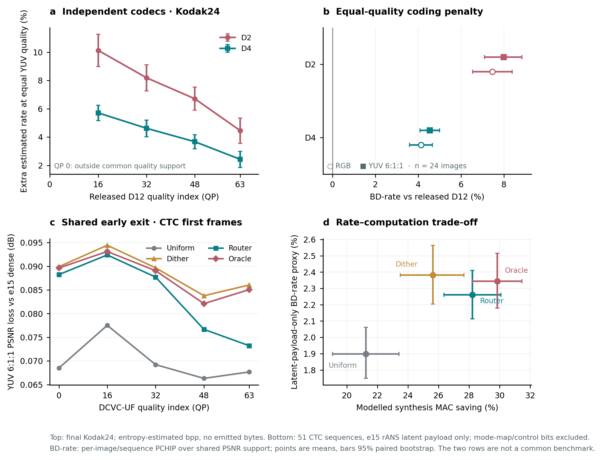

# İki sistem için denetlenebilir BD-rate analizi (2 Ekim 2026)

[Vektör PDF](../../figs/bd_rate_20261002/bd_rate_two_systems.pdf) · [Tam sayısal çıktı](analysis.json) · [Yeniden üretim betiği](../../scripts/bd_rate_two_systems_20261002.py)

## Hangi iki sistemi ölçüyoruz?

**Bağımsız codec bankası:** Open Images ile ayrı ayrı eğitilmiş, 105. epoch sonundaki D2 ve D4 decoder'ları; referans olarak Microsoft'un yayımladığı D12 decoder. Kodak24'ün tam çözünürlüklü 24 görüntüsünde QP 0, 16, 32, 48, 63. Buradaki rate, modelin deterministik **entropi tahmini**; henüz yazılmış gerçek bitstream uzunluğu değil. D6/D8/D10 ve bizim sıfırdan eğitilmiş D12 henüz bu karşılaştırmaya eklenmedi. D2 ile D4'ün birbirinden bağımsız ağırlıkları var; patch yönlendiricisi uygulanmadı.

**Paylaşılan latent early exit:** e15 çalışmasındaki tek DCVC-UF latentini kullanan dense/full-frame referans ve uniform, dither, router, oracle çıkış kuralları. CTC'nin ilk kareleri; her politikada bütün beş QP sonucu bulunan aynı 51 sekans. 0,1 dB nominal kalite bütçesi ve **kaynak görüntüsüne göre kalibre edilmiş** kural ayarları kullanıldı. Rate, round-trip doğrulanmış e15 rANS **latent payload** uzunluğu; politika haritası, kontrol bilgisi, kalibrasyon, kap ve diğer yan bilgiler dahil değil. Bütün politikalar aynı QP'de aynı latent payload'u kullandığından burada ölçülen sayı, kalite düşüşünün RD eğrisindeki *eşdeğer rate cezası*. Tam codec BD-rate'i değildir.

Bu iki deneyin sayıları farklı veri kümeleri, ağırlıklar, rate tanımları ve karar mekanizmaları kullandığı için **birbirleriyle doğrudan kıyaslanamaz**. Örneğin D2'nin +%7,99'u ile router'ın +%2,26'sını aynı tablo sıralaması olarak okumak yanlış olur.

## Hesap ve belirsizlik

Her Kodak görüntüsü için `log(bpp)`–PSNR eğrisi beş QP ile monoton PCHIP kullanılarak kuruldu. D2, D4 ve released D12'nin **üçlü ortak PSNR aralığında** log-rate farkı entegre edildi; üstel dönüşüm sonrası 24 görüntünün BD-rate yüzdeleri ortalandı. Bu, ortalama RD eğrisinin BD-rate'i değil, görüntü bazlı BD-rate ortalamasıdır. RGB PSNR ve YUV 6:1:1 PSNR ayrı ayrı işlendi.

Early exit'te aynı işlem her sekansa, dense ve dört politikanın **beşli ortak PSNR aralığında**, gerçek latent payload bpp ile yapıldı; 51 sekansın BD-rate proxy yüzdeleri ortalandı. PSNR, arşivdeki YUV 6:1:1 metriğidir. Grafikteki belirsizlik çubukları 5.000 tekrarlı, görüntü/sekans kümesi bazlı yüzde 95 bootstrap aralıklarıdır. Eğitimin farklı random seed'lerinden kaynaklanan belirsizliği içermez. Eğriler üzerinde QP arası enterpolasyon vardır; ortak aralığın dışına ekstrapolasyon yoktur.

Kodak'taki QP-bazlı “ek rate” ayrıca released D12'nin o QP'deki **aynı görüntü kalitesini** hedef alır ve D2/D4 eğrisinde gerekli tahmini bpp'yi enterpole eder. Bu, sabit QP'deki PSNR farkı değil, *eşit kalite için rate farkı*dır. QP 0'da bu kalite yalnız 1/24 görüntü için diğer eğrilerin desteği içinde kaldığından grup ortalaması raporlanmaz.

## Bağımsız decoder bankası: Kodak24

Released D12'ye göre görüntü bazlı BD-rate; pozitif değer eşit kalitede daha fazla tahmini bit demektir:

| Kalite metriği | D2 | D4 |
|:--|--:|--:|
| RGB PSNR | +%7,47 [%6,54, %8,39] | +%4,14 [%3,60, %4,67] |
| YUV 6:1:1 PSNR | **+%7,99 [%7,09, %8,84]** | **+%4,54 [%4,09, %4,99]** |

YUV 6:1:1 için released D12'nin belirli QP'sindeki kaliteye erişmenin ek tahmini bit maliyeti:

| Released QP | Kapsanan görüntü | D2 ek rate | D4 ek rate |
|--:|--:|--:|--:|
| 0 | 1/24 | Grup sonucu yok | Grup sonucu yok |
| 16 | 24/24 | +%10,13 [%8,99, %11,26] | +%5,71 [%5,17, %6,24] |
| 32 | 24/24 | +%8,19 [%7,26, %9,11] | +%4,62 [%4,02, %5,20] |
| 48 | 24/24 | +%6,71 [%5,90, %7,53] | +%3,67 [%3,17, %4,17] |
| 63 | 23/24 | +%4,46 [%3,55, %5,35] | +%2,43 [%1,85, %2,99] |

Bu aralıkta D4, D2'den tutarlı biçimde released D12'ye daha yakın. Her iki küçük decoder'ın eşit kalite rate cezası QP 16'dan QP 63'e azalıyor. Bu eğilim, eğitim amaçlı QP ayarının monoton “kalite” yorumu yerine doğrudan released referans QP etiketleriyle ifade ediliyor; tablodaki sayılar aynı kaliteye hizalıdır. QP 0 hakkında destek dışına taşarak sonuç çıkarılamaz. Bu çalışma henüz patch sınırı, model-bank seçimi, kontrol bitleri ve ölçülmüş uçtan uca runtime içermiyor.

## Paylaşılan early exit: CTC ilk kareler

Dense e15 full-frame'e göre 0,1 dB nominal bütçede **latent-payload-only BD-rate proxy** ve yalnız decoder sentezi için **modellenmiş MAC tasarrufu**:

| Kural | BD-rate proxy | Sentez MAC tasarrufu |
|:--|--:|--:|
| Uniform | +%1,90 [%1,75, %2,06] | %21,25 [%19,05, %23,41] |
| Dither | +%2,38 [%2,20, %2,56] | %25,63 [%23,50, %27,66] |
| Router | **+%2,26 [%2,11, %2,41]** | **%28,22 [%26,35, %30,07]** |
| Oracle | +%2,34 [%2,18, %2,52] | %29,85 [%28,23, %31,46] |

Uniform en düşük BD proxy'yi verirken en az hesaplamayı kurtarıyor. Bu nedenle early-exit politikasını yalnız BD-rate ile seçmek eksik: kalite–hesaplama Pareto karşılaştırması gerekli. Router, aynı arşivde dither'a göre ortalama **0,120 yüzde puan daha düşük BD proxy** (%95 eşlenik aralık: −0,210 ila −0,058) ve **2,60 yüzde puan daha fazla** modellenmiş MAC tasarrufu sağlıyor. Bu ikisi farklı eksenlerdir; “%2,60 daha hızlı” anlamına gelmez. Oracle etiketi burada her metrikte üstün olacağı anlamına gelmiyor: arşivde her kural ayrı seçim/bütçe prosedürüyle elde edilmiş ve rate–hesaplama işletim noktaları aynı değil.

Router ile dither'ın **aynı QP ve sekans üzerindeki eşlenik farkları** aşağıda. Negatif PSNR-loss farkı router'ın daha az kalite kaybettiği anlamına gelir; pozitif MAC farkı router'ın daha çok sentez hesabı kurtardığı anlamına gelir.

| QP | Router − dither PSNR kaybı (dB) | Router − dither MAC tasarrufu (yüzde puan) | Okuma |
|--:|--:|--:|:--|
| 0 | −0,0017 [−0,0031, −0,0003] | +2,06 [1,37, 2,80] | Küçük kalite farkı; hesaplama kazancı |
| 16 | −0,0020 [−0,0034, −0,0008] | +2,85 [2,09, 3,72] | Küçük kalite farkı; hesaplama kazancı |
| 32 | −0,0020 [−0,0043, +0,0000] | **+3,42 [2,53, 4,38]** | En büyük MAC marjı; kalite farkının aralığı sıfırı kesiyor |
| 48 | −0,0071 [−0,0122, −0,0035] | +2,86 [1,87, 3,90] | Daha belirgin kalite farkı |
| 63 | **−0,0128 [−0,0227, −0,0059]** | +1,77 [0,58, 2,81] | En belirgin kalite farkı; daha küçük MAC marjı |

Yuvarlatılmış tabloda QP 32 kalite aralığının üst sınırı +0,0000 görünür; tam sayı +0,000038 dB ve sıfırı gerçekten kapsar. Dither'a göre kalite avantajı QP 48/63'te daha belirgin; hesaplama avantajı QP 32'de tepe yapıyor. Bu **kaynak-kalibrasyonlu** arşiv sonucu, sabit kontrol ayarlarıyla ayrılmış test sekanslarında router üstünlüğünü kanıtlamaz. Ayrıca mode-map bitleri eklendiğinde RD sıralaması değişebilir.

## Sonraki ölçüm ve makale için sınır

1. D6/D8/D10 ve sıfırdan eğitilmiş D12 tamamlandığında aynı Kodak24 QP protokolünü bitstream byte'larıyla ve released D12 ile uygula; bu analizdeki tahmini-rate sonucunu tam-codec BD-rate olarak yeniden adlandırma.
2. Banka yönlendiricisi ile shared early exit için aynı test görüntüleri, aynı YUV hesabı, gerçek mode-map/container bitleri ve uçtan uca encode/decode süreleriyle ortak Pareto cephesi kur. Ayrı decoder bankasının model seçimini, shared early-exit router'ıyla karıştırma.
3. Router seçicisini ayrı eğitim/doğrulama/test parçalarında dondur; dither ve uniform ile eşit **gerçek bit bütçesi ve toplam runtime** altında kıyasla. Patch birleştirme, halo ve sınır artefaktlarını ayrıca ölç.

Kaynak dosya SHA-256 değerleri, her görüntü/sekans BD proxy sonuçları ve tam hassasiyetli belirsizlik sınırları `analysis.json` içinde bulunur. Yeniden üretim: `python3 scripts/bd_rate_two_systems_20261002.py`.
