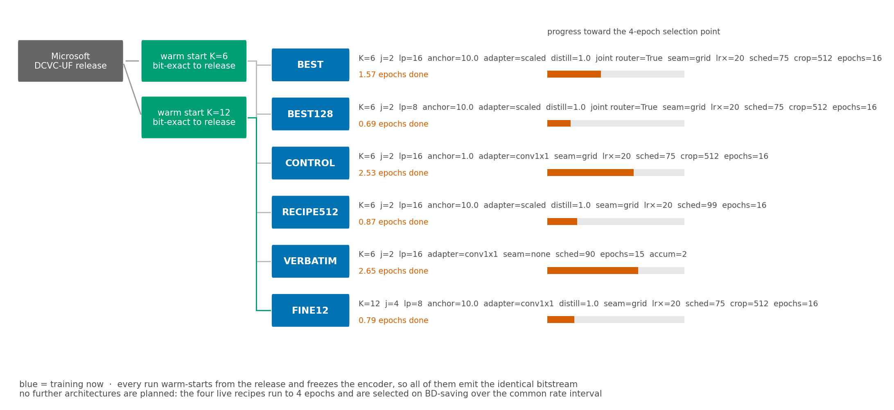

# Experiment plan

## The question

> Given a frozen DCVC-UF bitstream, how much decode compute can be removed by
> letting each region of a frame exit the decoder at its own depth, and what does
> that cost in quality?

The answer is a curve, not a number: every point on it trades dB against
compute. The project's job is to measure that curve honestly and to say which
part of it comes from the architecture and which from fine-tuning.

**Target.** 30% of decode compute removed at a quality cost of 0.1 dB, across
the rate range. Met at qp 0 and 16, not yet at 32/48/63 — see
[03 — Results](03-results.md).

## What is held fixed

The encoder, hyperprior and entropy model are frozen in every run — all six pass
`--freeze_encoder`, and every evaluation re-proves it by asserting the encoder
weights are bit-identical to the reference's. This is a constraint of the
experiment, not a tuning choice: it keeps the coded payload identical to the
release, so a stock decoder can read a FLEX-UF stream. Any run that unfroze them
would be measuring a different codec and could not be compared with the release
at all.

The shipped configuration does add 79–95 bits per frame — the exit map, signalled
from the encoder — which is 0.008–0.020% of the bitrate and is reported
separately as `bpp_added`. The alternative configuration, where the decoder runs
its own router, leaves the file byte-identical and costs 0.044% of the decode
instead. Both are measured; see
[02 — Architecture](02-architecture.md#what-is-trained).

## Protocol

**Training data.** OpenImages, 379,614 images (`description.json`). One epoch is
47,451 steps at batch 8. Crops are converted RGB → YCbCr before the −0.5 shift,
matching `~/DCVC/src/datasets/image_dataset.py`; any evaluation that feeds raw
RGB is measuring a different colour space and produces meaningless numbers.

**Held-out data.** `description_val.json`, 512 images, zero overlap with the
training set. Used to separate "lost generality" from "lost transfer to video",
which the training log cannot distinguish because it only ever sees images the
model is currently learning from.

**Test set.** 40 CTC sequences at 1920×1080 and 1280×720. The other 13 CTC
sequences are not on disk on this server; each results file records both
`measured` and `not_measured` so a result can never silently be a different test
set from the one it is compared against. This has bitten before: a frame-count
mismatch once produced a low-rate regression that did not exist, and the claim
had to be withdrawn.

**Rates.** qp 0, 16, 32, 48, 63 — the full range of the released model.

**Metric.** dB below the released decoder, per-frame convention (the one
`~/DCVC/test_video.py` computes), against compute saved as a fraction of one
**stock** decode — not of our own ladder at full depth, which costs 1.0095 and
was the denominator until 2026-08-17. Operating points are found by bisection on the Lagrangian
multiplier, so a quoted budget of 0.1 dB is exactly 0.1 dB. Full definitions in
[02 — Architecture and accounting](02-architecture.md).

## The runs

Every run warm-starts from the release. `K` decides how the twelve trunk blocks
are grouped, so a `K=12` run needs its own remap and cannot be quoted against the
`K=6` one — `flexuf/reference.py` resolves the right warm start by `K` and
refuses to substitute. Both remaps are proved bit-exact to the release.

| run | what it is | distinguishing flags |
|---|---|---|
| **BEST** | the headline configuration | `anchor 10`, `adapter scaled`, `distill 1.0 adjacent`, `--joint_router`, 256px tiles |
| **BEST128** | BEST at 128px tiles — finer routing granularity, more tiles, higher seam cost | `latent_patch 8` |
| **FINE12** | a 12-rung ladder, split at 4 | `K=12 j=4`, 128px tiles, conv1×1 adapters |
| **RECIPE512** | BEST's recipe at a later schedule position, full crops | `epoch_offset 99`, no `--min_crop` |
| **CONTROL** | BEST minus the additions: weak anchor, plain adapter, no distillation, no joint router | `anchor 1.0`, `adapter conv1x1` |
| **VERBATIM** | Microsoft's schedule untouched: base learning rate, no seam repair, no anchor term | no `--new_lr_scale`, `seam none`, `accum 2` |

`CONTROL` and `VERBATIM` are not ablations of the deliverable — they are the two
reference points that tell us whether the additions are doing anything and
whether the training recipe itself is sound. `CONTROL` isolates the additions;
`VERBATIM` isolates the recipe.

The exact argv of every live run is frozen in [`runs.json`](runs.json) by
`scripts/snapshot_runs.py`. It has to be captured while the jobs are alive: the
training flags live only in the process argv, and four of them separate `BEST`
from `CONTROL` — two runs whose second epochs move in opposite directions.

## Selection

All runs train to **4 epochs**, then are ranked by **BD-saving over a rate
interval shared by every curve being compared**, per-frame dB convention. Not by
the saving at a single budget: that depends on which budget you pick, and the
ranking can invert between 0.05 and 0.19 dB.

The shared interval is the part that is easy to get wrong, in two opposite ways.
Deriving the interval per curve makes checkpoints incomparable. Pinning one
interval globally runs off the end of a shorter frontier and silently compares a
3-rate mean against a 5-rate mean. `scripts/common_interval.py` derives one
interval from all curves in the comparison, and the evaluation chain recomputes
*every* curve on it whenever a new checkpoint lands.

`-e 16` in the launch commands is the trainer's schedule length, not a plan to
train for sixteen epochs.

## Evaluation chain

Each new checkpoint runs seven stages (`scripts/watch_ckpts.sh`), serialised on
a lock so evaluations never contend for the GPUs the training jobs are using:

1. `anchor_drift` — is the deepest exit still the released decoder?
2. `oracle_diagnostic` — how much of the frontier is reachable at all
3. `signalled_curve` — the shipped system: encoder picks, decoder is told
4. `paper_curve` + `bd_saving` — the frontier, and BD on the common interval
5. `why_qp_val` — per-exit quality on held-out images
6. `crosscheck_paths` — do the independent evaluation paths still agree?
7. `target_gap` — distance to the 30%-at-0.1 dB target

Stage 1 is a standing alarm rather than a report. The deepest exit is supposed to
stay bit-exact to the release; if it drifts, everything downstream is being
measured against a moving reference. The alarm has been miscalibrated twice — it
first fired at |t| ≈ 1.6 on pure noise, then a 25-point window caught a
fluctuation four times the epoch trend. It now requires an epoch-long slope with
t < −3 **and** < −0.5 dB/epoch.

## Schedule

Rough wall-clock, measured from the logs of six runs sharing the server's GPUs
(so these include contention, and are upper bounds on what any single run needs):

| run | epochs done | ≈ h/epoch | ≈ h to 4 epochs |
|---|---|---|---|
| VERBATIM | 2.08 | 6 | 12 |
| CONTROL | 2.22 | 13 | 23 |
| BEST | 1.38 | 21 | 56 |
| FINE12 | 0.58 | 19 | 65 |
| RECIPE512 | 0.67 | 20 | 67 |
| BEST128 | 0.51 | 22 | 77 |

The next scheduled measurement is **BEST at epoch 1**, which closes the missing
control described in [04 — Open questions](04-open-questions.md).

## Quantisation: a second lever on the same budget

Early exit removes MACs. Quantisation makes the MACs that remain cheaper. They
act on the same 0.1 dB budget, so they can be priced against each other in the
one currency this project already uses.

**What must not be quantised.** The encoder, hyperprior and entropy model. They
produce `y_hat` and the symbol probabilities; perturbing either changes the
bitstream, and an entropy model that disagrees between the two ends does not
degrade gracefully, it destroys the stream. Only `dec.*` and `router_head.*` are
touched, and the encoder is asserted bit-identical afterwards — the same check
every other measurement here makes.

**The unit.** MAC counts do not move under quantisation, so "% of MACs saved"
cannot express it. BOPs — MACs weighted by the product of operand widths — can:
an int8/int8 MAC costs 8·8 against fp32's 32·32, so 16× less. That is an
idealised hardware model, so BOPs are reported *alongside* the MAC-based saving,
never instead of it.

**The question worth asking** is not "does quantisation cost quality" — it does —
but whether it costs the **shallow** exits more than the deep ones. If it does,
the two levers compete for the same budget instead of composing, and the exit
ladder's advantage shrinks as the decoder is quantised harder. That is a
prediction, and it is registered here before the measurement:

> Quantisation noise and early exit are **sub-additive**. A shallow exit has
> already discarded most of the trunk's refinement and has less capacity to
> absorb an additional perturbation, so its dB penalty under quantisation should
> grow faster than the deepest exit's. Concretely: at qp 63 and 8-bit weights,
> exit 2's degradation should exceed the deepest exit's by more than a factor of
> two. If the penalties are instead roughly uniform across exits, the levers
> compose and the ladder's advantage survives quantisation intact.

**Result: the prediction was wrong, and instructively so.** At 8 bits the
degradation is uniform across exits (0.099–0.124 dB at qp 63) — exit 2 against
the deepest is a ratio of 0.97, not the >2 predicted. At 6 and 4 bits the
*deepest* exits degrade most. The reason is the opposite of the one assumed: the
deepest exit starts near-perfect (0.073 dB at qp 63) and has no headroom to
absorb an added noise floor, while a shallow exit's error is already dominated by
the blocks it skipped.

What this does to the ladder is the finding that matters. The spread between the
shallowest and deepest exit at qp 63 goes 2.864 dB (fp32) → 2.876 (8 bit) →
2.224 (6 bit) → 1.398 (4 bit). Routing exploits exactly that spread, so:

- **8-bit weights are nearly free and compose cleanly** — the spread is intact,
  BOPs drop 16×.
- **6 bits and below erode the ladder itself**, because quantisation noise
  flattens the differences the router decides on.

One caveat against reading "8 bits is free" too broadly: at qp 63 it still
raises the deepest exit from 0.073 to 0.184 dB, 2.5×. The floor already consumes
30% of the 0.1 dB budget at that rate, and 8-bit weights enlarge it. Free applies
to the *spread*, not to the *floor*.

**First pass** (`scripts/quant_sweep.py`): weight-only, symmetric,
per-output-channel PTQ at 8, 6 and 4 bits. No calibration set, no fine-tuning —
deliberately the weakest form, so the numbers bound quantisation from below
rather than flattering it. Measured on held-out OpenImages in YCbCr, reporting

- the **floor**: how far the deepest exit drifts from the release, which already
  consumes 30% of the budget at qp 63, and
- **per-exit dB**, which is what decides whether the levers compete.

**If the first pass is promising**, the follow-ups in order are activation
quantisation with a calibration set, then quantisation-aware fine-tuning of the
adapters only (they are 3.1M of the 17.5M trained parameters and are where the
shallow exits' capacity lives), then the joint allocation question: given 0.1 dB
total, what split between bit-width and exit depth minimises BOPs.

This does not disturb the six training runs — it is post-training, reads a
checkpoint, and needs no gradient.

## What gets trained next

**No new architectures are planned.** The six live runs cover the design space
this experiment is about; the remaining work is to finish them and select. In
particular, no further ablations will be added — the failure mode here is not too
few configurations but too few epochs on the ones that exist, and the measured
saving is still climbing at every checkpoint we have.

After selection, one run continues at the winning configuration for as long as
it keeps improving on the held-out measurement. The stopping signal is that
measurement, not the training loss: the loss is flat from about step 5,000
onward and correlates 0.97 with the batch's bitrate, so it says almost nothing
about the decoder — see [03 — Results](03-results.md).
