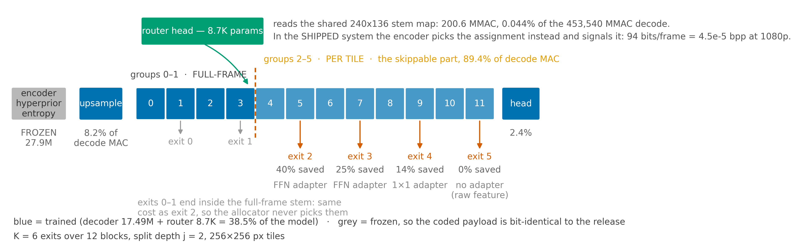

# Architecture and accounting



## The decoder we are modifying

DCVC-UF's intra decoder `DMCI` is three parts. Measured with forward hooks on
every `nn.Conv2d` at 1920×1088 (`scripts/mac_audit.py`):

| part | GMAC | share | routable? |
|---|---|---|---|
| opening upsample | 37.01 | 8.16% | no — runs full-frame, always |
| trunk: 12 identical `DepthConvBlock`s | 405.64 | 89.44% | **yes** |
| head | 10.89 | 2.40% | no |
| **total** | **453.54** | **100%** | |

Nearly ninety per cent of the decode sits in twelve interchangeable residual
blocks. That is the entire opportunity: if some regions of a frame do not need
all twelve, the blocks they skip are the expensive part.

## The exit ladder

The twelve blocks are grouped into `K` exits, `12/K` blocks each. A **split
depth** `j` divides them:

- groups `0 … j−1` run **once for the whole frame** (the *stem*),
- groups `j … K−1` run **per 256×256 tile**, and a tile leaves at its own depth.

The production configuration is `K = 6`, `j = 2`: two groups (four blocks) of
shared stem, four groups (eight blocks) that tiles can skip.

Each non-deepest exit carries an **adapter** that maps its truncated feature into
something the head can read. `BEST` uses `--adapter_kind scaled`, which sizes the
adapter to how much it has to stand in for: exits that skip four or more blocks
get an FFN, the rest a 1×1.

| exit | 0 | 1 | 2 | 3 | 4 | 5 |
|---|---|---|---|---|---|---|
| adapter | FFN | FFN | FFN | FFN | 1×1 | none |
| parameters | 739,200 | 739,200 | 739,200 | 739,200 | 147,840 | 0 |
| cost, in `DepthConvBlock`s | 0.249 | 0.249 | 0.249 | 0.249 | 0.125 | 0 |

Billing them all at one rate would either overcharge the deep exits or —
worse, and in our favour — undercharge the shallow ones, which are exactly the
exits a saving figure leans on.

The deepest exit carries **no adapter**: it takes the raw feature straight to the
head, which is what makes it bit-exact to the release.

### The exits are not all distinct

Per-tile cost, in units of one full stock decode (`flexuf/cost.py`):

| exit | 0 | 1 | 2 | 3 | 4 | 5 |
|---|---|---|---|---|---|---|
| cost | 0.5809 | 0.5809 | 0.5809 | 0.7300 | 0.8697 | 1.0095 |
| saved vs deepest | 42.5% | 42.5% | 42.5% | 27.7% | 13.8% | 0% |

Exits 0 and 1 end **inside the stem**, which runs for the whole frame whether or
not any tile stops early. Stopping there therefore costs exactly what stopping
at exit 2 costs, and the allocator can never prefer them. With `j = 2` the ladder
has six rungs but **four distinct prices**. This is `j`-dependent, not
`K`-dependent: `K = 12, j = 4` ties exits 0–4 the same way.

This matters for reading histograms. An exit-usage plot that counts exits 0, 1
and 2 as separate bars reports 29.5% where 33.8% of tiles actually sit, and the
bars sum to 95% instead of 100%.

### The ladder is not free at full depth

The deepest exit costs **1.0095**, not 1.0 — 0.95% *more* than the stock
decoder. All of it is `seam_repair="grid"`, a cheap pass that repairs the
boundaries between independently-decoded tiles. It is a fixed tax paid on every
frame regardless of how the router behaves.

Every saving quoted in these documents is net of it — but only since the
denominator was corrected. The curve producers divided saving by this 1.0095
rather than by the release's 1.0, which took the tax straight back out of the
figure it was supposed to be inside. The correction costs 0.6–0.75 points at
every rate and is described in
[03 — Results](03-results.md#the-denominator-and-why-it-moved-every-number).

## What the router costs

The router is a `StemRouterHead`:

```
proj : Conv2d(384 → 16, 1×1)          on the 240×136 stem map at 1080p
mlp  : Linear(33 → 64) → SiLU → Linear(64 → 6)     once per tile
```

8,726 parameters. Its arithmetic:

| | MAC at 1080p | share of the 453,540 MMAC decode |
|---|---|---|
| `proj` over 240×136 | 200.5 M | 0.0442% |
| `mlp` × 40 tiles | 0.1 M | 0.00002% |
| **total** | **200.6 M** | **0.044%** |

Two things make this cheap. It reads the *stem output* — a tensor the decoder has
already computed and would compute anyway — so it adds no forward pass of its
own. And it projects 384 channels down to 16 before doing anything per-tile, so
the only full-resolution work is a 1×1.

### The jointly-trained router has collapsed to a constant

Measured on `runs/BEST/ckpt_eval.pth.tar`, 240 tiles, `scripts/router_curve.py`:

| qp | router's choice | oracle's choice | agreement |
|---|---|---|---|
| 0 | 240/240 → exit 2 | mostly exit 2 | 0.838 |
| 32 | 210/240 → exit 3 | 238/240 → exit 2 | 0.125 |
| 63 | 239/240 → exit 4 | 240/240 → exit 2 | **0.000** |

Mean confidence 0.96–0.9998: it is certain, and at high rate it is certainly
wrong. What it has learned is a rule in `qp` alone — deeper exit at higher qp —
which is the *marginal* distribution of the oracle's choice, not the conditional
one. It never looks at the content. The agreement of 0.838 at qp 0 is not
evidence against this: the oracle also sends almost everything to exit 2 there,
so a constant agrees with it by construction.

The consequence is sharp. A constant policy is one operating point, not a curve,
so there is no budget to bisect: at qp 0 the only two allocations reachable are
41.9% saved at 0.234 dB (everything at exit 2, more than twice the budget) and
−1.0% at 0.003 dB (everything at the deepest exit, where the −1.0% is the
seam-repair tax). Nothing lies between them.

So the sentence that used to stand here — "the decoder-side router exists so the
system also works when the encoder does not cooperate" — is **false for this
checkpoint**. Without the signalled map, this checkpoint has no working
content-adaptive routing at all, and the 34.0%/20.8% headline depends entirely
on the encoder's decision being transmitted.

This is a known failure mode in the project's own history — the first regret
sweep also produced a constant router — and it is a *training* failure, not an
information-theoretic limit: a dedicated router trained against a frozen decoder,
with loss-free load balancing toward the oracle's own exit mix, previously
reached 0.86–0.93 agreement on an older checkpoint. What collapsed it here is
joint training with the decoder. Retraining it against BEST's frozen decoder is
in progress.

**In the shipped system the decoder does not run the router at all.** The encoder
already has the source frame, so it picks the exit assignment there and signals
it. Measured cost of the map: **79–95 bits per frame**, rising with rate as the exit histogram flattens, which at 1920×1080 is
4.5 × 10⁻⁵ bpp — against a bitstream of 0.22–0.55 bpp, five to twelve thousand
times smaller. The decoder-side router is meant to be the fallback when the
encoder does not cooperate; it is trained jointly in the `BEST`/`BEST128` runs
(`--joint_router`), and in `BEST` that joint training has collapsed it to a
constant — see below.

So the total overhead the scheme adds to a decode is **0.95% (seam repair) +
0.044% (router, only if run decoder-side)**, and every reported saving is already
net of both.

## What is trained

| | parameters | trained? |
|---|---|---|
| encoder + hyperprior + entropy model | 27,947,520 | frozen |
| decoder (`dec.*`) | 17,489,152 | trained |
| router head (`router_head.*`) | 8,726 | trained |
| **total** | **45,445,398** | **38.5% trained** |

`--freeze_encoder` sets `requires_grad` from `name.startswith(("dec.", "router_head."))`.
This is not asserted and trusted: `paper_curve.py`, `signalled_curve.py` and
`why_qp_val.py` each compare the checkpoint's encoder against the reference's and
abort unless `max |difference| == 0.0`, so every measurement re-proves it.

Freezing the analysis side is not an optimisation — it is what keeps the **coded
payload** bit-identical to stock DCVC-UF. Two claims live near each other here
and they are not the same claim:

| | file on disk | decoder-side cost |
|---|---|---|
| decoder-side router | **byte-identical** to a stock stream | +0.044% (the router runs) |
| signalled map (**what the headline numbers measure**) | payload identical, **plus 79–95 bits/frame** | 0 (the decoder is told) |

The signalled map costs 0.008–0.020% of the bitrate — 79–95 bits against 461,000 at
qp 0 and 1,133,000 at qp 63. It is recorded per measurement as `bpp_added` and is
*not* folded into the compute saving, because bits and MACs are separate axes.

**Those bits are not a convenience — they currently carry all of the content
adaptation.** See below.

#### Why the bitrate changes at all, when the encoder does not

Two different things are easy to conflate here.

The encoder *network* is untouched: analysis transform, hyperprior and entropy
model are frozen, so the arithmetic-coded **image payload** is bit-identical to
what stock DCVC-UF produces. The extra bits are not the encoder emitting
something different.

They are a **new syntax element**. The exit map does not exist in DCVC-UF at
all — it is not image data but a control signal telling the decoder which of the
six exits each of the 40 tiles should use. The decoder has to be told, so a field
is added to the file, and the file grows. The network is unchanged; the
*bitstream syntax* is not.

The encoder is the one that decides because the decision needs the true per-tile
error of every exit, which needs the source frame, and only the encoder has it.
What it performs is a search, not a retraining: for each tile, decode with all
six exits, measure MSE against the source, take `argmin(MSE + λ·cost)`. This is
the same shape as mode decision in HEVC/VVC — the transform is not changed, an
RDO step is added beside it.

| qp | map bits | model | payload | bits/tile | frame bits | overhead |
|---|---|---|---|---|---|---|
| 0 | 94 | 48 | 46 | 1.14 | 461,493 | 0.020% |
| 32 | 94 | 48 | 46 | 1.15 | 615,097 | 0.015% |
| 63 | 90 | 48 | 42 | 1.05 | 1,133,348 | 0.008% |

Uncoded, 40 tiles over 6 exits would cost 40·log₂6 = 103 bits; the distribution
is far from uniform, so entropy coding brings the payload to 42–49. Note that
the 48-bit "model" — a per-frame histogram, so the decoder can build the
arithmetic coder — is *larger than the payload it enables*. A shipping codec
would use a fixed or adaptive context and roughly halve the total; it is left as
it is because a bound in the safe direction is worth more than 50% of a
negligible quantity. At 60 fps the whole map is 5.6 kbit/s.

#### The three configurations

| | file | decoder cost | decision quality |
|---|---|---|---|
| **A. Signalled** — the headline numbers | payload identical, **+79–95 bits/frame** | none, it is told | exact (oracle) |
| **B. Decoder-side router** | **byte-identical** | 0.044% (V1) / 0.163% (V2) | collapsed in BEST; being retrained |
| **C. Stock decoder** | reads either file | — | full depth, no exits |

Interoperation holds either way: a stock decoder reads the payload in both
configurations, and a FLEX-UF decoder handed a stock stream simply has no map, so
it falls back to its own router or to full depth.

**The headline numbers are fine-tuned, not architectural.** The warm start alone
— the released weights re-expressed in ladder form, zero training — saves only
0.3–1.6% at the 0.1 dB budget. The trained checkpoint saves 20.8–34.0%. The
architecture supplies the mechanism, not the gain: it contributes under two
points of the thirty-four.

## The warm start is provably the released decoder

Every number in this project is "x% saved at y dB below DCVC-UF", and the
reference is the warm start. If the remap from released weights into ladder form
were wrong, every result would be wrong *consistently* — the curves, the BD
numbers and the verdicts would all agree with each other and all be measured
against the wrong decoder.

`tests/test_reference_is_the_release.py` closes this. It loads Microsoft's own
`DMCI` class with the released checkpoint, runs their own `forward_one_frame`,
runs our deepest exit on the same latent, and asserts:

```
max |x_hat_theirs − x_hat_ours| == 0.0
```

Exactly zero, at qp 0, 32 and 63, for both warm starts (`K=6` and `K=12` are
different groupings of the same twelve blocks and each needs its own proof).

## How "compute saved" is computed

Given an exit assignment for a frame's tiles, the frame's cost amortises the
shared work over the tiles (`frame_relative_cost`):

```
cost = stem + head + mean over tiles( per-tile suffix + adapter )
```

expressed as a fraction of one stock decode. **Saving = 1 − cost**, and the
denominator is the stock decode's 1.0, not our deepest exit's 1.0095. The stem and
the head are charged once per frame because they run once per frame; the trunk
groups past the split are charged per tile.

Three things are charged that a looser accounting would drop:

1. **The halo.** A tile decoded in isolation has no neighbours, so its border
   pixels convolve against padding. Carrying a halo of real context makes the
   tile physically larger — side `F` with halo `h` computes `((F+2h)/F)²` as many
   pixels. At `F=16`, `h=4` that is 2.25×. Applying it to the whole per-tile
   trunk would consume more than routing saves, so the halo is carried on the
   **head only** (2.40% of MACs), and the adapters are trained to absorb the
   residual seam.
2. **Seam repair**, +0.95%, on every frame.
3. **The clamp.** `forward()` does `exit_map.clamp(min=j)`, so a tile nominally
   assigned an exit shallower than the split still runs group `j`. The cost model
   applies the same clamp. It did not always: an earlier version let a
   below-split exit be billed as "left at the split", which reported 58.70%
   saved where the real figure was 42.9% — and that inflated number made the
   router appear to beat the Lagrangian bound, which is impossible. The
   impossibility is what exposed the bug.

### From an assignment to a curve

A single assignment gives one (quality, saving) pair. The curve comes from
sweeping a Lagrangian: for a multiplier λ, assign each tile the exit minimising
`distortion + λ · cost`, which traces the Pareto frontier of the allocation
problem. To hit an *exact* quality budget — "what is saved at exactly 0.1 dB" —
λ is found by **bisection**, not by picking the best sample from a grid.

That distinction is not cosmetic. Reading "the last grid sample under budget"
makes the answer depend on where the grid happens to fall; at qp16 it once made
a checkpoint look 9.7 points better than it was.

### Two dB conventions, and which one is quoted

There are two defensible ways to turn per-tile errors into one number:

- **pooled** — all tiles of all frames into one MSE, then one PSNR. Natural for
  the Lagrangian, since that is the quantity being optimised.
- **per-frame** — PSNR per frame, then averaged. This is what
  `~/DCVC/test_video.py` computes, so it is what a DCVC-UF number means.

On an identical allocation they differ by 0.023–0.033 dB, and pooling is always
the flattering one. **Every number in these documents is per-frame.** Both are
stored (`db_vs_uf` and `db_vs_uf_per_frame`) so a mix-up is detectable; one such
mix-up once explained a 5.4-point disagreement between two paths that were
supposedly measuring the same thing.

### Bjøntegaard-style integrals

Single-budget numbers depend on the budget. `scripts/bd_saving.py` integrates
saving over a dB interval (BD-saving) and quality over a saving interval
(BD-quality). Both need a **common interval across checkpoints** — otherwise two
checkpoints are integrated over different ranges and the comparison is
meaningless. `scripts/common_interval.py` derives one interval from all curves
being compared, and the evaluation chain recomputes *every* curve on it whenever
a new checkpoint arrives.
