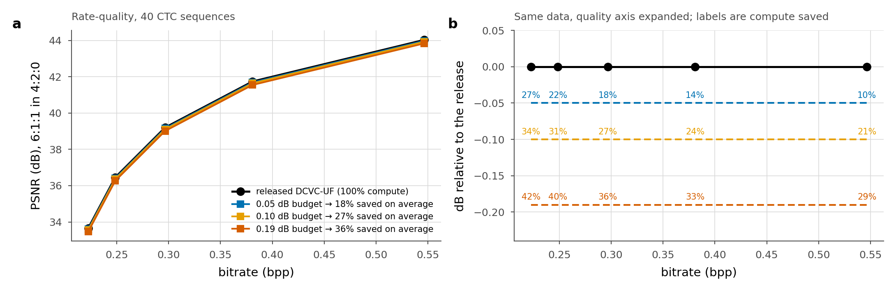
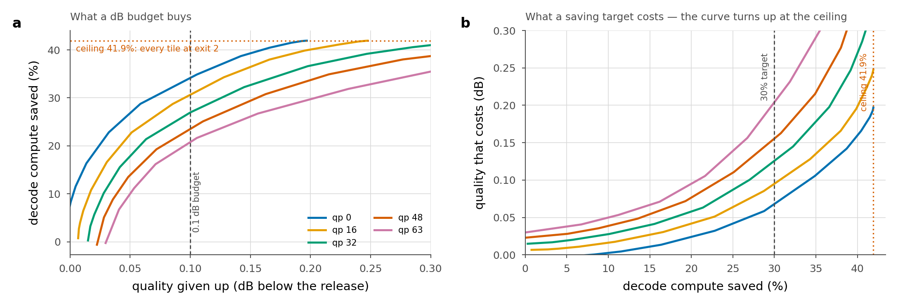
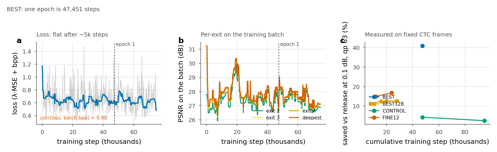
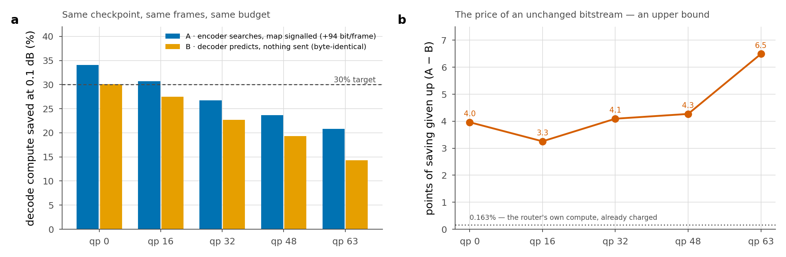

# Results

Everything below is `runs/BEST/ckpt_eval.pth.tar` — one checkpoint, at the end of
epoch 0. No other run has been measured past its first epoch, and the measured
saving is still climbing at every checkpoint we have, so these are a floor rather
than a final result.

## Rate–quality



Panel **a** plots absolute PSNR against bitrate in the units a codec paper is
read in: the released decoder in black, and three compute budgets on top of it.
They are visually indistinguishable, which is the point — at 0.1 dB the four
curves are within the thickness of the line.

Panel **b** expands the quality axis by a factor of about two hundred so the
budgets separate, and labels each point with the compute it buys. Reading the
0.10 dB line left to right: **34% saved at the lowest rate, 21% at the highest.**

> **Denominator.** Every saving below is divided by the cost of the *released*
> decoder, which is 1.0 in these units. The curve producers historically divided
> by our own ladder at full depth (1.0095 — the deepest exit pays seam repair,
> the release does not), which reported 0.6–0.75 points more at every rate. The
> numbers here are the corrected ones; see [Denominator](#the-denominator-and-why-it-moved-every-number) below.

## The trade-off

> **Unit.** Everything in this document is **decode MACs**. That is not the same
> as wall-clock: measured end-to-end, the 0.1 dB allocation runs 6.6–19.4% faster
> rather than 27%, and the 0.3 dB allocation 20.8–36.1% rather than 39.8%. The
> shortfall is a fixed 3.7–7.5% tiling overhead plus the per-group bookkeeping
> (32% of the group loop, and recoverable). See [06 — CVPR plan](06-cvpr-plan.md).

Compute saved at a fixed quality budget, measured on 40 CTC sequences with the
exit map signalled from the encoder (the shipped configuration):

| budget | qp 0 | qp 16 | qp 32 | qp 48 | qp 63 |
|---|---|---|---|---|---|
| 0.05 dB | 26.8% | 22.4% | 17.9% | 13.9% | 10.0% |
| **0.10 dB** | **34.0%** | **30.7%** | **26.8%** | **23.6%** | **20.8%** |
| 0.19 dB | 41.7% | 39.5% | 36.0% | 32.9% | 29.0% |

The 0.10 dB row is the signalled system measured directly; the other two are read
off the same frontier by interpolation.

Two regularities hold across the whole table.

**Saving falls as rate rises.** From 34.0% at qp 0 to 20.8% at qp 63 — a third of
the saving disappears. At high rate the reconstruction carries detail that the
shallow exits cannot reproduce, so fewer tiles can leave early. The frontier is
convex everywhere (verified by a secant test, no curve fitting), and the convexity
margin grows tenfold from low rate to high.

**Saving is worth more than it looks.** Giving up 0.1 dB buys 21–34% of the
decode. Going the other way — spending compute to gain quality — the same 0.1 dB
would cost far more than the 30% you would save, which is why the trade is
attractive at all.

### The trade-off in both directions



Panel **a** is the frontier itself: what a dB budget buys, at each rate. Panel
**b** is the same data read the way a deployment decision is usually made —
*I need this much compute back, what does it cost me* — and it is the reading
that exposes the ceiling. Below about 25% the cost curve is nearly flat: another
five points of saving costs two or three hundredths of a dB. Past 35% it turns
up sharply, and at 41.9% it becomes vertical.

### Bjøntegaard integrals

A single budget is a single budget. Integrated over the dB interval
[0.064, 0.196] shared by all curves in the comparison:

| qp | 0 | 16 | 32 | 48 | 63 |
|---|---|---|---|---|---|
| BD-saving | 36.9% | 33.8% | 30.0% | 26.7% | 23.5% |

BD-saving runs 2.7–3.2 points above the 0.1 dB figure at every rate, because the
budget sits below the interval's midpoint. (BD-*quality* — dB given up over a
fixed saving interval — is not restated here: correcting the denominator moves
the interval endpoints themselves, so it needs recomputing rather than
rescaling.)

### Distance to the 30% target

| qp | 0 | 16 | 32 | 48 | 63 |
|---|---|---|---|---|---|
| saved at 0.1 dB | 34.2% | 30.6% | 27.0% | 23.5% | 20.8% |
| dB needed for 30% | 0.068 | 0.095 | 0.126 | 0.156 | 0.204 |

Met at qp 0, and at qp 16 by six hundredths of a point — comfortably before the
denominator correction, marginally after it. At qp 63 reaching 30% costs
0.204 dB, double the budget. Every rate is *reachable*, meaning the frontier's
floor lies below the target; the shortfall is a matter of price, not of
possibility.

**There is also a ceiling, and it is architectural.** The most the ladder can
ever save, at any quality, is **41.9%** — every tile at exit 2, the shallowest
exit that is not dominated. It is identical at all five rates because it is set
by the split depth: the stem (4 blocks, full-frame), the head and seam repair
are never skippable. Training moves the operating point along the curve toward
that ceiling; only the split raises the ceiling itself.

How it depends on the ladder (`flexuf/cost.py`, arithmetic only):

| K | j | stem blocks | blocks run at exit j | ceiling |
|---|---|---|---|---|
| 6 | 1 | 2 | 4 | 56.8% |
| **6** | **2** | **4** | **6** | **41.9%** ← BEST |
| 6 | 3 | 6 | 8 | 27.0% |
| 12 | 4 | 4 | 5 | **50.3%** ← FINE12 |
| 12 | 5 | 5 | 6 | 41.9% |

The BEST/FINE12 row pair is worth reading twice. **They have the same 4-block
stem, and FINE12's ceiling is 8.4 points higher.** Nothing about the shared
computation differs; what differs is granularity. With `K=12` an exit lands
every block, so a tile can leave one block after the stem. With `K=6` exits land
every two blocks, so the first stop after the stem is two blocks later, and every
tile pays for a block it may not need.

FINE12 is currently behind BEST on measured saving (16.76% against 20.80% at
qp 63), but it has had 0.58 epochs against 1.38 and it is aiming at a ceiling
8.4 points further away. That is a reason to run it to four epochs before
concluding anything, not a reason to prefer it now.

### The frontier has a floor, and it is not free

The floor — the best quality the ladder can produce at any compute — is not
0 dB. It runs from −0.002 dB at qp 0 to +0.030 dB at qp 63. The deepest exit
costs 1.0095 stock decodes (the seam-repair tax), and residual drift in the
fine-tuned decoder puts a small quality gap under everything at high rate. At
qp 63 that floor consumes 30% of the 0.1 dB budget before the router has made a
single decision.

## Where the saving comes from

| | qp 0 | qp 63 |
|---|---|---|
| warm start, **zero training** | 1.6% | 0.3% |
| BEST, **one epoch** | 34.0% | 20.8% |

The architecture alone — the ladder, the tiling, the exits, the cost model, the
Lagrangian allocator, all correct and all in place — saves 1.6% at the lowest
rate and 0.3% at the highest. Fine-tuning the decoder inside that architecture
multiplies that by 21× at qp 0 and 83× at qp 63. The ladder is the mechanism
that makes the saving *expressible*; it is not the source of the gain.

The ratio is dramatic partly because the untrained ladder starts so close to
zero: at qp 63 it saves a quarter of a point, so almost any improvement is a
large multiple. The absolute statement is the safer one — **the architecture
contributes under two points of the thirty-four.**

This is the single most important thing to state accurately about this project.
The result is a fine-tuning result delivered through an architectural mechanism,
and reporting it as an architectural result would be wrong.

## Fidelity of the deepest exit

The deepest exit is supposed to be the released decoder. After a full epoch of
fine-tuning:

| qp | 0 | 16 | 32 | 48 | 63 |
|---|---|---|---|---|---|
| released PSNR | 33.659 | 36.454 | 39.200 | 41.736 | 44.028 |
| ours at deepest exit | 33.656 | 36.445 | 39.184 | 41.712 | 43.995 |
| drift | −0.003 | −0.009 | −0.016 | −0.023 | −0.033 |

Drift is monotone in rate and reaches −0.033 dB at qp 63. It is small, but it is
not zero and it is not noise, and it is exactly the floor that shows up in the
table above. A decoder that must interoperate with stock streams gives this up
in exchange for the exits.

## Training and convergence



**Panel a — the loss is not a convergence signal.** It drops for about 5,000
steps and is flat from there through the end of epoch 1. It would be easy to read
that as convergence. It is not: the loss is `λ·MSE + bpp`, and the bitrate of a
random 256px crop swings twofold between consecutive batches — 0.32 to 0.61 within
ten records. The correlation between the loss and the batch's bpp is **0.97**. The
curve is mostly reporting what the dataloader handed the model.

**Panel b** — per-exit PSNR on the training batch, same caveat. It shows the
ladder is healthy: the exits stay ordered and about 1 dB apart, and none has
collapsed onto its neighbour.

**Panel c — the measurement that does answer the question.** Compute saved at
0.1 dB, qp 63, on the same fixed CTC frames every time. Two runs have more than
one measured checkpoint, and both are still climbing at 20–24k steps:

| run | 8k | 12k | 16k | 20k | 24k |
|---|---|---|---|---|---|
| BEST128 | 11.23% | — | 12.40% | 12.56% | — |
| FINE12 | — | 14.96% | — | — | 16.76% |

So: **the loss plateaus long before one epoch; the quantity we care about does
not.** Training longer is still paying, which is why the plan is to run every
recipe to four epochs before selecting.

`CONTROL` is the exception — it moves the other way across its second epoch, from
4.25% down to 2.47%. That is unexplained and is the subject of
[04 — Open questions](04-open-questions.md).

## Two ways to decide, and what the difference costs

Summarised here; the full head-to-head — encoder and decoder compute, bits,
deployability, failure modes — is [05 — A versus B](05-decision-ab.md).



The exit assignment can come from either side, and the paper compares both. Same
checkpoint, same 40 frames, same 0.1 dB budget, both quoted against the release:

| qp | **A** — encoder searches, map signalled | **B** — decoder predicts, nothing sent | gap |
|---|---|---|---|
| 0 | 34.04% | **30.07%** | −3.96 |
| 16 | 30.70% | 27.44% | −3.26 |
| 32 | 26.76% | 22.66% | −4.09 |
| 48 | 23.62% | 19.35% | −4.27 |
| 63 | 20.80% | 14.31% | −6.49 |

**A** has the source frame, so it decodes each tile at all six exits, measures
the true error and takes `argmin(MSE + λ·cost)`. Exact, but the result must be
transmitted: ~94 bits per frame, 0.008–0.020% of the bitrate.

**B** cannot see the source. It predicts what A would have chosen, from the stem
map, the latent and the entropy model's scales — all of which the decoder already
holds. Nothing is transmitted and the file is byte-identical to a stock stream.
B's numbers are net of the router's own arithmetic, 0.163% of the decode.

So **an unchanged bitstream costs 3.3–6.5 points of saving**, and at the lowest
rate the 30% target is still met without touching the file at all.

### The gap is not mostly prediction failure

The gap above is an upper bound on "what seeing the source frame is worth",
because it mixes two effects. They can be separated, and when they are, they turn
out to move in **opposite** directions.

Measuring the router against the oracle frontier at the *same* λ and the *same*
quality — no bisection, no tilt, so the only thing that differs is the decision
itself (`scripts/router_curve.py --at_lam`):

| qp | agreement with the oracle | prediction loss at matched quality | gap at the 0.1 dB budget | \|β\| the tilt needed |
|---|---|---|---|---|
| 0 | 0.554 | **7.23** | 3.96 | 12.2 |
| 16 | 0.622 | 3.64 | 3.26 | 3.0 |
| 32 | 0.731 | 2.08 | 4.09 | 12.5 |
| 48 | 0.830 | 0.95 | 4.27 | 23.1 |
| 63 | 0.861 | **0.80** | **6.49** | 30.7 |

Prediction loss falls almost tenfold from low rate to high, while the budgeted
gap rises. So the 6.49 points at qp 63 are **not** the router failing to predict:
that is where it predicts best, agreeing with the search on 86% of tiles and
giving up only 0.8 points at matched quality.

What the budgeted gap tracks instead is |β| — how far the router had to be
dragged from the operating point it was trained at. The router is trained at a
single λ = 1.3 × 10⁻⁵, while the λ that lands on 0.1 dB runs from 4.9 × 10⁻⁵ at
qp 0 to 4.1 × 10⁻⁶ at qp 63, and the tilt has to make up the difference. As |β|
grows the cost term dominates the logits, the allocation degenerates toward "all
tiles at one exit", and the router's content ranking — the only thing it
contributes — is exactly what gets discarded.

That points at a fix rather than a limit: λ is not an input to the router, only
qp is. Conditioning on λ, or training one router per operating point, should
recover most of the high-rate gap. Neither was done here, because it would change
the experiment mid-flight.

**These two numbers are not additive components.** They are measured at different
operating points, which is why the prediction loss at qp 0 (7.23) can exceed the
budgeted gap there (3.96) without contradiction: the router's trained point sits
at 0.0605 dB, on a much steeper part of the frontier than 0.1 dB.

The router used here is **not** the one in the checkpoint. `BEST`'s
jointly-trained head has collapsed to a constant (see
[02 — Architecture](02-architecture.md#the-jointly-trained-router-has-collapsed-to-a-constant));
this is a `StemRouterHeadV2` retrained against BEST's *frozen* decoder, reaching
0.848 held-out agreement with the oracle. That is the finding behind the whole
comparison: the decoder-side path works, but only when the router is not trained
against a moving decoder.

## The denominator, and why it moved every number

The curve producers computed

```
saving = 1 − cost[k].mean() / cost[-1]
```

with costs in units of one stock decode. `cost[-1]` is **our** ladder at full
depth — 1.0095, because the deepest exit pays `seam_repair="grid"` and the
released decoder does not. So the reported figure answered "what does early
exiting save against our own full-depth path", while every sentence around it
said "against the released DCVC-UF decoder", whose denominator is exactly 1.

The effect is a uniform optimism of 0.62 points at qp 0 rising to 0.75 at qp 63,
and it hid precisely the seam-repair tax the accounting section claims to
include. `scripts/renormalise_saving.py` performs the correction (exact algebra
on stored curves, no re-measurement), and both curve producers now record
`saving_pct_vs_release` alongside the original field.

Two consequences worth stating plainly:

- **Rankings between checkpoints of the same run are unaffected** — the map is
  affine and monotone, so it cannot reorder anything.
- **Rankings across runs are not necessarily safe.** `VERBATIM` runs
  `seam_repair="none"`, so its denominator was already 1.0 and its numbers do
  not move at all, while every other run loses 0.6–0.9 points. The uncorrected
  comparison quietly favoured the seam-repaired runs — including in the
  `CONTROL` vs `VERBATIM` comparison that
  [04 — Open questions](04-open-questions.md) turns on.

## What these numbers are measured against

The saving is against **the real DCVC-UF decoder**, not against a re-trained
baseline or an anchor of our own. The reference is Microsoft's released
checkpoint re-expressed in ladder form, and
`tests/test_reference_is_the_release.py` proves the two produce identical pixels
(`max |difference| = 0.0`) through Microsoft's own class and forward function, at
qp 0, 32 and 63, for both warm starts.
