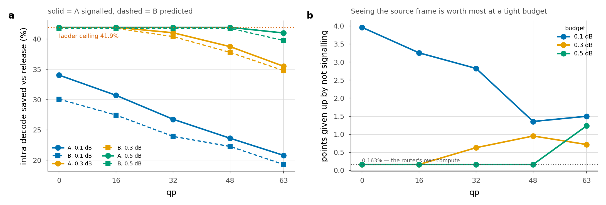

# A versus B: who decides which exit each tile takes

The exit ladder is the same in both. The decoder is the same checkpoint. The only
thing that differs is **where the exit assignment comes from**, and that one
choice changes the bitstream, the compute budget on each side, and whether the
scheme can be deployed by one party or needs both.

- **A — the encoder searches, and signals the result.** It has the source frame,
  so it can measure exactly what each exit would cost each tile and pick the best.
  The answer then has to be transmitted.
- **B — the decoder predicts, and nothing is sent.** It cannot see the source, so
  it infers the assignment from what it already holds. The file is untouched.


## Head to head

| | **A** — encoder searches | **B** — decoder predicts |
|---|---|---|
| **Who decides** | encoder | decoder |
| **Information used** | the **source frame**: true per-tile MSE at every exit | stem map, latent `y_hat`, entropy-model scales, qp — all decoder-side |
| **Decision rule** | `argmin_k (MSE[tile,k] + λ·cost[k])`, λ bisected to the budget | `argmax_k (log softmax(logits)[k] − β·cost[k])`, β bisected to the budget |
| **Optimality** | exact — it is the oracle | approximate — 0.55–0.86 agreement with A, by rate |
| **Extra encoder compute** | **≈1.21 decodes/frame** (one shared trunk pass, then adapter+head at all 6 exits) | none — encoder entirely untouched |
| **Extra decoder compute** | none — it is told | **0.163%** of one decode (V2 head); 0.044% for the smaller V1 |
| **Bits added** | **~94 bits/frame** (0.008–0.020% of the bitrate) | **zero** |
| **File** | coded payload identical, plus a map field | **byte-identical** to a stock stream |
| **Bitstream syntax** | needs a new field → both ends must agree | unchanged → deployable by a decoder vendor alone |
| **Encoder weights** | frozen (verified `max\|diff\| = 0.0` every run) | frozen (same check) |
| **Extra training** | none | one router head per operating point (144K params, ~30 min) |
| **Known failure mode** | none observed | collapses to a constant if trained jointly with a moving decoder |

The compute asymmetry is the part that is easy to misread. A costs **745×** more
arithmetic than B — but it spends it at the *encoder*, once, while B spends its
much smaller amount at the *decoder*, on every playback. For VOD, where one
encode serves millions of decodes, A is the cheaper choice in total even though
it is the more expensive one per frame. For live or symmetric applications the
ranking inverts.

## Results, same checkpoint and same frames

> Both configurations are compared in **MACs**. The wall-clock realisation is
> measured separately and is lower for both — see
> [06 — CVPR plan](06-cvpr-plan.md). The A/B *difference* is a difference in
> which tiles exit where, so the same discount applies to both sides.

Compute saved at a 0.1 dB budget, against the released DCVC-UF decoder, 40 CTC
sequences. B is net of the router's own 0.163%.

| qp | 0 | 16 | 32 | 48 | 63 |
|---|---|---|---|---|---|
| **A** signalled | 34.04% | 30.70% | 26.76% | 23.62% | 20.80% |
| **B** predicted | **30.07%** | 27.44% | 22.66% | 19.35% | 14.31% |
| gap (A − B) | 3.96 | 3.26 | 4.09 | 4.27 | 6.49 |
| map bits A sends | 94 | 97 | 94 | 95 | 90 |
| A's bitrate overhead | 0.020% | 0.019% | 0.015% | 0.012% | 0.008% |

For scale, the same ladder with **no training at all** saves 1.64% at qp 0 and
0.25% at qp 63, and the architectural ceiling — every tile at the shallowest
non-dominated exit — is 41.9% at every rate.

**An unchanged bitstream costs 3.3–6.5 points of saving with a single router,
and 1.35–3.96 once the router is trained for its operating point** (see below).
At the lowest rate the 30% target is met without adding a single bit to the file.

## Where the gap actually comes from

The gap is *not* mostly the router failing to predict. Measured at matched λ and
matched quality — no bisection, no tilt, so only the decision differs
(`scripts/router_curve.py --at_lam`):

| qp | agreement with A | B's loss at matched quality | gap at the 0.1 dB budget | \|β\| the tilt needed |
|---|---|---|---|---|
| 0 | 0.554 | **7.23** | 3.96 | 12.2 |
| 16 | 0.622 | 3.64 | 3.26 | 3.0 |
| 32 | 0.731 | 2.08 | 4.09 | 12.5 |
| 48 | 0.830 | 0.95 | 4.27 | 23.1 |
| 63 | 0.861 | **0.80** | **6.49** | 30.7 |

The two columns move in **opposite** directions. Prediction loss falls almost
tenfold from low rate to high; the budgeted gap rises. At qp 63 — where the gap
is largest — the router agrees with the search on 86% of tiles and gives up only
0.8 points at matched quality. It is predicting *well* there.

What the budgeted gap tracks is |β|: how far the router had to be dragged from
the operating point it was trained at. The router is trained at one λ = 1.3×10⁻⁵,
while the λ that lands on 0.1 dB runs from 4.9×10⁻⁵ at qp 0 to 4.1×10⁻⁶ at qp 63.
As |β| grows the cost term dominates the logits, the allocation degenerates
toward "all tiles at one exit", and the router's content ranking — its only
contribution — is what gets thrown away.

That points at a fix rather than a limit: **λ is not an input to the router, only
qp is.** A prediction to that effect was registered before the test was run
(`DECISIONS.md` 63a–b) and then measured.

### The fix, tested

A second router was trained at λ = 4.1 × 10⁻⁶ — the value that lands on 0.1 dB at
qp 63 — and evaluated identically. Two predictions were written down first: the
qp 63 gap should fall below 3 points, and the qp 0 gap should *worsen*, because
that router is now the one being dragged furthest from its training point.

| qp | A | B at λ=1.3×10⁻⁵ | B at λ=4.1×10⁻⁶ | best available |
|---|---|---|---|---|
| 0 | 34.04% | 30.07% (−3.96) | 28.53% (**−5.51**) | −3.96 |
| 16 | 30.70% | 27.44% (−3.26) | 26.87% (−3.82) | −3.26 |
| 32 | 26.76% | 22.66% (−4.09) | 23.93% (−2.82) | −2.82 |
| 48 | 23.62% | 19.35% (−4.27) | 22.27% (−1.35) | −1.35 |
| 63 | 20.80% | 14.31% (−6.49) | **19.30% (−1.50)** | −1.50 |

Both predictions hold. The qp 63 gap collapses from 6.49 to **1.50** points and
|β| there falls from 30.7 to 4.2; the qp 0 gap grows from 3.96 to 5.51.

**So the price of an unchanged bitstream is not 3.3–6.5 points — with a router
trained for the operating point it is 1.35–3.96.** Five routers, one per rate,
cost 5 × 144,024 = 720K parameters, 1.6% of the 45.4M model. The two-router
envelope above is a lower bound on what per-rate training would give.

> **One claim walked back.** An earlier draft said the gap tracks |β| "almost
> one-to-one". Pooling all ten measurements the correlation is only 0.663, and
> the second router breaks monotonicity outright — gap 1.35 at |β| = 13.4 against
> 5.51 at |β| = 16.0. |β| is a rough proxy for distance from the training
> operating point, not a sufficient statistic. What the data supports is the
> weaker and still useful statement: training the router at the operating point's
> λ matters, and matters most where the mismatch was largest.

> ⚠️ **These are not additive components.** They are measured at different
> operating points, which is why B's loss at qp 0 (7.23) can exceed the budgeted
> gap there (3.96) without contradiction — B's trained point sits at 0.0605 dB,
> on a steeper part of the frontier than 0.1 dB. Do not present them as a
> decomposition that sums to the gap.

## How the gap depends on the budget



Everything above is at 0.1 dB. Loosening the budget changes the picture
completely:

| qp | A @0.1 | B @0.1 | gap | A @0.3 | B @0.3 | gap | A @0.5 | B @0.5 | gap |
|---|---|---|---|---|---|---|---|---|---|
| 0 | 34.04 | 30.07 | 3.96 | 41.91 | 41.75 | **0.16** | 41.91 | 41.75 | **0.16** |
| 16 | 30.70 | 27.44 | 3.26 | 41.91 | 41.75 | **0.16** | 41.91 | 41.75 | **0.16** |
| 32 | 26.76 | 23.93 | 2.82 | 41.02 | 40.39 | 0.63 | 41.91 | 41.75 | **0.16** |
| 48 | 23.62 | 22.27 | 1.35 | 38.73 | 37.78 | 0.95 | 41.91 | 41.75 | **0.16** |
| 63 | 20.80 | 19.30 | 1.50 | 35.49 | 34.78 | 0.72 | 40.98 | 39.75 | 1.23 |

At 0.3 dB, not signalling costs between 0.16 and 0.95 points — against 1.35–3.96
at 0.1 dB. At 0.5 dB it is 0.16 everywhere except the highest rate.

The budget stops being spendable once the ceiling is reached, which the realised
dB makes explicit — with a 0.5 dB budget granted, A actually spends:

| qp | 0 | 16 | 32 | 48 | 63 |
|---|---|---|---|---|---|
| dB spent of a 0.5 dB budget | 0.197 | 0.248 | 0.344 | 0.449 | 0.500 |

Only qp 63 can use the whole budget. Everywhere else the ladder runs out of
rungs first, which is why the saving column flattens onto 41.91% and the gap
collapses onto the router's own 0.163%. **The value of seeing the source frame is largest exactly where the
budget is tightest.** As the budget loosens the allocation degenerates toward
"most tiles at the cheapest exit", the per-tile decision stops mattering, and an
approximate router catches up with an exact search.

The 0.16 at qp 0 and 16 is worth reading closely: both configurations are sitting
on the ladder's 41.9% ceiling there, so the allocation is *identical* and the only
difference left is the router's own arithmetic — 0.163% of the decode, which is
0.16 points. The decomposition is exact, with nothing unexplained.

A second consequence, visible in panel **a**: at 0.3 dB the rate dependence
largely flattens (41.9 / 41.9 / 41.0 / 38.7 / 35.5 for A). The steep fall from
low to high rate at 0.1 dB is a property of the *budget*, not of the ladder —
low rates saturate against the ceiling while high rates keep climbing, and the
spread closes.

## The finding that made B possible at all

`BEST` trains its own router jointly with the decoder (`--joint_router`), and
that head has **collapsed to a constant**: it picks one exit per qp and ignores
the content entirely, agreeing with A on 0.000 of tiles at qp 63. With it, B has
no curve to bisect — at qp 0 the only reachable allocations are 41.9% saved at
0.234 dB and −1.0% at 0.003 dB, with nothing in between.

Every B number above uses a `StemRouterHeadV2` **retrained against BEST's frozen
decoder**, which reaches 0.848 held-out agreement. Same architecture, same
information, same decoder — the difference is training against a fixed target
instead of a moving one. So the collapse is a training failure, not an
information-theoretic limit, and it is the reason the decoder-side path looked
impossible until it was retrained.

## Which to use

| if you need… | choose |
|---|---|
| the most saving, and can change the bitstream | **A** |
| an unchanged file, or cannot standardise a new syntax element | **B** |
| VOD, one encode serving many decodes | **A** — its cost is amortised |
| live or symmetric encode/decode | **B** — the encoder pays nothing |
| a decoder-only upgrade, no encoder cooperation | **B** — it is the only option |

## Reproducing

```bash
# A — encoder searches, map signalled
python scripts/signalled_curve.py --ckpt runs/BEST/ckpt_eval.pth.tar \
  --device cuda:0 --frames 1 --out results/signalled_BEST.json

# B — decoder predicts, nothing sent
python scripts/train_router2.py --ckpt runs/BEST/ckpt_eval.pth.tar \
  --lam 1.3e-5 --steps 3000 --out runs/BEST/routers2/v2_lam1.3e-5.pth
python scripts/router_curve.py --ckpt runs/BEST/ckpt_eval.pth.tar \
  --device cuda:0 --frames 1 --router2 runs/BEST/routers2/v2_lam1.3e-5.pth \
  --out results/router_BEST_v2.json

# the decomposition: both at the same lambda, no bisection
python scripts/router_curve.py --ckpt runs/BEST/ckpt_eval.pth.tar \
  --device cuda:0 --frames 1 --router2 runs/BEST/routers2/v2_lam1.3e-5.pth \
  --at_lam 1.3e-5 --out results/router_BEST_v2_atlam.json
```

Both paths are kept and neither overwrites the other: `results/signalled_*.json`
and `results/router_*.json`. Stage 3b of `scripts/watch_ckpts.sh` runs them as a
**matched pair** on every new checkpoint — same frames, same budget — so the
comparison is always within one checkpoint rather than across two.
