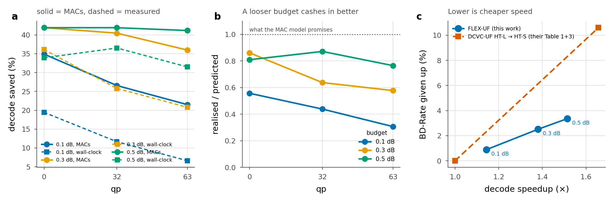

# What this needs before it is a CVPR paper

An honest assessment, written from the measurements rather than from hope. The
method works and the accounting is unusually careful, but as it stands a reviewer
has two questions we cannot answer, and either one is enough to sink it.

## The claim the paper should make

> A neural image decoder can spend its compute where the content needs it,
> buying **1.14–1.51× real decode speedup at a flat 6.5 BD-Rate points per unit
> of speedup — 2.4× cheaper than shrinking the model**,
> with a bitstream that is **byte-identical** to the unmodified codec, so it
> deploys as a decoder-only upgrade with no encoder cooperation and no syntax
> change.

The wall-clock figure is now measured, and it is **not** the MAC figure. See §1.

The byte-identical property is the distinctive part. Most complexity-reduction
work changes the model on both sides, or signals side information. Our B
configuration changes neither, and costs only 0.16–1.5 points against the
signalled oracle. That is the paper.

## Tier 1 — without these it is rejected

### 1. Wall-clock decoding latency — MEASURED, and it is the problem I expected

`scripts/latency.py`, 1920×1088 padded to 2048×1280, 40 interleaved
iterations, median, device pinned:

| qp | stock | all-deepest | routed | sorted | overhead | **realised** | predicted (MAC) |
|---|---|---|---|---|---|---|---|
| 0 | 110.6 ms | 114.5 | 79.7 | 78.4 | 3.6% | **29.1%** | 35.3% |
| 32 | 110.6 ms | 114.7 | 87.1 | 85.8 | 3.6% | **22.4%** | 28.0% |
| 63 | 110.8 ms | 114.8 | 94.9 | 93.6 | 3.6% | **15.6%** | 20.1% |

**Operations are an optimistic bound, by about a fifth, and the optimism grows
with the saving.** The gap splits in two:

- a fixed **overhead floor of 3.6%** — what the tiling machinery costs with
  every tile at the deepest exit, i.e. running exactly the stock arithmetic;
- the rest, the **inter-group bookkeeping**: the boolean mask, gather and
  scatter run at every group boundary and force a device-to-host sync each
  time. Invisible to the MAC model and, unlike a hardware limit, partly
  recoverable: sorting the tiles by exit depth once and taking contiguous
  slices returns 1.2 points, bit-identically.

  (Every number in this section was re-measured after `torch.cuda.Event` was
  found to be timing the wrong device. The earlier table — stock at 303/296/296
  ms and a realised saving of 19.4/11.6/6.6% — was that bug, and so was the
  claim that the MAC model overstates by 2–3×.)

  (An earlier draft attributed this to falling arithmetic intensity. Measured
  per-tile group cost is flat or improving as the active set shrinks — 1.03,
  0.93, 0.73, 0.94 ms/tile across groups 2–5 — so that explanation was wrong
  and is withdrawn. `scripts/latency_profile.py`.)

Two caveats on the measurement, both pointing the same way:

- It ran on **GPU 2 at 100% utilisation**, shared with VERBATIM's training. The
  absolute latencies are unrepresentative — 453 GMAC on an idle A6000 should be
  ~12 ms, not 300 — so these numbers must not be quoted as decode speeds. The
  *ratios* are what this measures, and the three variants were interleaved one
  iteration at a time so that drift in the neighbouring job lands on all three
  equally. A first version timed 40 of each in sequence; the interleaved rerun
  moved the answers by under a point, so contention drift was not the story.
- No inference optimisation: fp32, no channels_last, no `torch.compile`, no
  CUDA graphs. Kernel-launch overhead is a large part of what is being paid,
  and those are exactly the tools that reduce it.

**What this changes.** The abstract cannot say "27% faster". It can say "27%
fewer MACs and 6–19% faster in this implementation", and the gap becomes a
result in its own right — content-adaptive depth is easy to state in MACs and
hard to cash in on a GPU, which is worth telling the field. It also makes the
engineering below a contribution rather than a chore.

Panel **c** is the one to put in the paper. Note that DCVC-UF's line joins two
published model sizes, so it is a two-point exchange rate rather than a measured
curve — but it is the rate the field currently pays, and ours sits below it
everywhere we measured.

### The picture after measuring at all three budgets

| budget | BD-Rate | MAC saved | wall-clock saved | speedup | **BD-Rate points per unit of speedup** |
|---|---|---|---|---|---|
| 0.1 dB | 0.88% | 27.6% | 12.6% | 1.14× | **6.2** |
| 0.3 dB | 2.51% | 39.5% | 27.6% | 1.38× | **6.6** |
| 0.5 dB | 3.36% | 41.7% | 34.0% | 1.51× | **6.5** |

**The price of speed is flat at ~6.5 BD-Rate points per unit, right across the
budget range.** That is a cleaner result than any single operating point: the
method does not have a sweet spot to be accused of cherry-picking, it has an
exchange rate. Pick the point the application wants.

The tiling overhead, across all nine measurements, ranges 1.5–8.2% with a median
of 6.2%. It is a small difference between two ~300 ms timings on a card at 100%
utilisation, so the range is the honest quantity and a point estimate would be
false precision.

The looser budget is the better paper. At 0.3 dB the realised saving is a much
larger fraction of the predicted one (0.86 of it at qp 0 against 0.56 at 0.1 dB),
for two reasons that reinforce: tiles pile up at the shallowest exit so the deep
groups run on very few of them, and the fixed tiling overhead is amortised over
nearly twice the saving.

### This partly answers "why not just a smaller decoder"

DCVC-UF ships its own pair of model sizes, and the exchange rate they imply is a
free calibration of what this field pays for speed:

| | BD-Rate given up | speedup bought | points per unit of speedup |
|---|---|---|---|
| DCVC-UF HT-L → HT-S | 10.6 | 1.66× | **16.1** |
| FLEX-UF, any budget | 0.88–3.36 | 1.14–1.51× | **6.2–6.6** |

Adaptive depth buys speed about **2.4× more cheaply than shrinking the model**,
and does so at a constant rate rather than only at one favourable point.

Two honest caveats. Their pair is whole-video and ours is intra-only, so the
denominators differ and this is a calibration of the exchange rate rather than a
head-to-head. And HT-S differs from HT-L in width and block counts throughout,
not only in depth — which is why §2's own static baseline is still needed. But it
is a strong indication that the answer to the reviewer's question is favourable,
obtained for free from a table already in print.

**What to do next.**

1. Re-measure on an **idle card** to get quotable absolute numbers.
2. Re-measure at the **0.3 dB budget**, where the MAC saving is 41.9% and the
   fixed overhead is amortised over roughly twice the saving.
3. **Remove the per-group bookkeeping — prototyped and measured.** Sorting the
   tiles by exit depth once makes "still active at group g" a contiguous prefix,
   so each group takes a slice instead of a gather, and the slice boundaries come
   from one cumulative count instead of a mask (and a sync) per group. Measured
   on the group loop, with bit-identical output:

   | qp | saved at 0.1 dB | saved at 0.3 dB |
   |---|---|---|
   | 0 | 31.3% | 12.7% |
   | 32 | 23.4% | 36.6% |
   | 63 | 22.5% | 28.2% |

   Positive everywhere and bit-identical everywhere (`allclose` at
   `atol=rtol=0`). The **spread, 12.7–36.6%, is not explained**: the obvious
   hypothesis — that the gain tracks how many group boundaries still have tiles
   passing through them — correlates only 0.32 over these six points, so it is
   not supported. Six measurements on a card at 100% utilisation cannot settle
   it; what is established is that the gain exists and is never negative.

   Projected end to end at qp 32, applying that saving to the measured totals:
   11.6% → **20.7%** at 0.1 dB and 25.8% → **35.4%** at 0.3 dB, taking
   realised/predicted from 0.44 to 0.78 and 0.64 to 0.87. A projection, not a
   measurement — confirming it end to end means editing the decoder that six
   live runs import. `scripts/sorted_exec.py`.

   **Not yet landed in the decoder, deliberately.** The real loop in
   `flexuf/backbone/decoder.py` does three things the benchmark does not, and
   each has to be re-expressed through the permutation before the change is
   safe:

   - `self._at_exit(work[leaving], g)` — the boolean select becomes a
     contiguous slice `work[hi:lo]`, which is the easy part;
   - `tile_gate[active[leaving]]` — the straight-through router gate is indexed
     by original tile id, so it needs `order[hi:lo]`, not the sorted position.
     Getting this wrong would silently break the router's gradient while the
     reconstruction stayed bit-identical, so a pixel-equality test would not
     catch it;
   - `cpl.active = active` under `--tile_coupling` — canvas coupling needs to
     know which canvas slots the current tensor occupies. Simplest correct
     move is to restrict the sorted path to `not cfg.tile_coupling` and fall
     back otherwise.

   It should land behind a config flag defaulting to off, verified by both a
   pixel-equality test and a gradient test, and not while six runs import the
   file — a crash-restart would pick it up mid-experiment.

4. Then CUDA graphs or `torch.compile` on what remains.

**The original framing, kept for the record.** *The problem.* The field measures FPS. DCVC-UF's own paper devotes half of
Table 3 to it. We measure MACs. Per-tile variable-depth decoding has real
overhead a MAC count cannot see: kernel launches per depth group, gather/scatter
of tiles, patchify/unpatchify, the seam-repair pass, and reduced arithmetic
intensity when tiles are grouped into small batches. A reviewer will ask on the
first read, and "27% of MACs" is not an answer.

**What to do.** Implement grouped-by-depth tile execution — collect all tiles
assigned to exit *k*, run them as one batch through groups *j…k*, scatter back —
and measure end-to-end decode latency against the stock decoder on the same GPU,
with the same timing methodology the paper uses (actual bitstream reading).

**The risk to state up front.** If the realised speedup is much below the MAC
saving, that is itself a finding worth reporting, but the paper's framing has to
change from "27% faster" to "27% fewer MACs, N% faster in this implementation".
Do the measurement before writing the abstract, not after.

**Estimate.** 1–2 weeks of engineering, then a day of measurement.

### 2. The "just use a smaller decoder" baseline

**The problem.** This is the question that decides whether the paper has a
contribution at all. If a uniformly smaller decoder — fewer blocks, or narrower —
reaches the same MAC count at the same BD-Rate, then content adaptivity buys
nothing and the ladder is machinery for nothing.

**What to do.** Train a static decoder with the trunk truncated to the same
*average* depth the router selects, warm started and fine-tuned on the identical
schedule and data, and compare at matched MACs. The depths to match, measured
from the exit histograms at the 0.1 dB point:

| qp | 0 | 16 | 32 | 48 | 63 |
|---|---|---|---|---|---|
| mean trunk blocks run, of 12 | 6.95 | 7.80 | 8.04 | 8.30 | 8.78 |

So: a 7-block decoder at low rate and a 9-block one at high rate. If a single
static 8-block decoder matches us across the range, adaptivity has bought
nothing. Also compare against a distilled narrow decoder if time allows.

**The prediction, registered now.** The static decoder will lose more quality at
matched MACs, because the frontier is convex and a static allocation sits at its
mean rather than on it — but the margin may be small at loose budgets, where our
own A/B result already shows the allocation degenerating. If the static baseline
matches us within ~0.02 dB at matched MACs, the adaptive story is weak and the
paper should be re-framed around the byte-identical deployment property instead
of around the saving.

**Estimate.** One training run to 4 epochs, ~2 days on a free GPU.

### 3. Finish the runs and select properly

Six runs are training; none has reached the 4-epoch selection point, and the
measured saving is still climbing at every checkpoint we have. Every number in
this repository is one checkpoint of one run at one epoch. Publishing on that
would be publishing a lower bound and calling it a result.

**Estimate.** BEST needs ~56 h, BEST128 ~77 h, FINE12 ~65 h at current
contention — call it 1–2 weeks wall-clock with the current six-way sharing.

### 4. The complete test set

13 of the 53 CTC sequences (HEVC B, C and D) are not on this server, so every
number is on 40 sequences and the tables have holes exactly where reviewers look
for class-B 1080p content. **This is a decision for the user**: it means
downloading data onto a shared machine, which the working agreement rules out
without an explicit go-ahead.

## Tier 2 — makes it competitive rather than merely publishable

### 5. Ablations on an equal training budget

We have runs that vary K, tile size and the training recipe, but they have had
different amounts of training, so none of the comparisons is clean. The paper
needs, at matched epochs:

- `K` and `j`: the ladder's granularity and where the split falls. The ceiling is
  set by `j` alone (41.9% at j=2, 50.3% for FINE12's K=12/j=4), so this is a
  first-order design axis, not a detail.
- tile size: 128 against 256 px, trading routing granularity against seam and
  halo cost.
- signalled against predicted, which we already have at three budgets.

### 6. Comparison against published complexity-reduction work

At minimum: the RDC codec of Xie et al. (arXiv:2305.07678), which decodes an
adaptive spatial mask from side information at the decoder and so is the closest
prior art to our configuration B; and the spatial-competition codec
(arXiv:2605.13243), which transmits a per-region mode map at 1.8×10⁻⁴ bpp
against our 4.5×10⁻⁵. Neither targets decode MACs the way we do, and saying
precisely how they differ is part of the related-work section, not an optional
extra.

### 7. The anchor fix

`--anchor_per_sample` is implemented and off by default. The anchor is currently
scaled by the batch-mean λ, making it 39× too strong at qp 0 and 5× too weak at
qp 63 — backwards, since the drift it prevents is 10× larger at qp 63. Removing
the resulting floor is worth a measured **3.28 points at qp 63**, where the
method is weakest and reviewers will look hardest. One run.

## Tier 3 — strengthens, not required

- **A second decoder.** Does the ladder transfer to another neural codec's
  synthesis network, or is it a DCVC-UF-specific result? One transfer experiment
  changes the paper from a case study to a method.
- **Seeds and variance.** Every number is a single run. At least two seeds on the
  selected configuration.
- **Quantisation composition**, already measured: 8-bit weights preserve the
  exit spread (2.876 dB against fp32's 2.864) at 16× fewer BOPs, while 6 bits and
  below flatten the ladder. This is a good subsection; it is not a paper.

## Suggested order

The two Tier-1 experiments are independent and should run in parallel, because
either one can force a re-framing and it is cheaper to learn that early:

1. **Now**: start the static-decoder baseline (§2) and the latency harness (§1).
   Ask the user about the missing test data (§4).
2. **Weeks 2–3**: runs reach 4 epochs; select; run the anchor fix (§7).
3. **Weeks 3–5**: ablations at matched epochs (§5); write related work (§6).
4. **Weeks 5–7**: transfer experiment (§3 of Tier 3) if the schedule holds;
   seeds; write.

## The honest risk register

| risk | severity | how it is resolved |
|---|---|---|
| MAC saving does not become wall-clock saving | **high** | §1 — measure before writing |
| a static smaller decoder matches us | **high** | §2 — measure before writing |
| results are one checkpoint of one run | medium | §3 — finish training |
| incomplete test set | medium | §4 — user's decision |
| intra-only, so small in whole-video terms | medium | frame as image coding, which the user has confirmed is the target |
| single codec | low | Tier 3 |

The two high-severity rows are both measurements we have not made, and both can
change what the paper claims. Everything else is work, not uncertainty.
