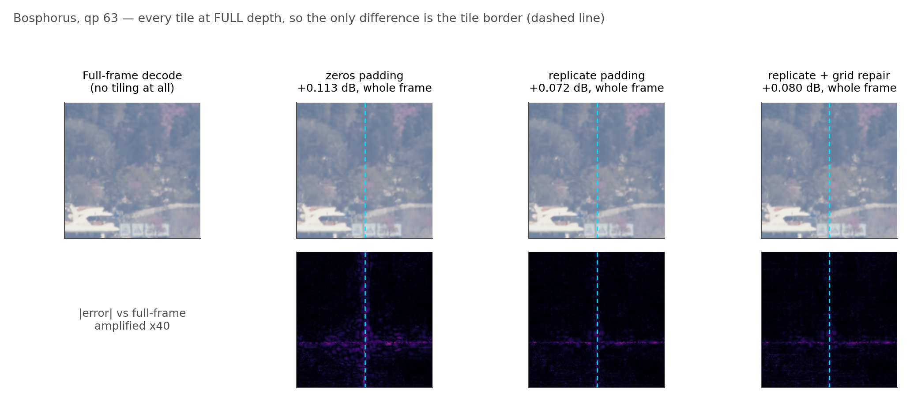

# The seam artefact: what went wrong, and what fixed it

## The bargain, and the bill

Early exit needs tiles. A frame decoded as one piece pays whatever its hardest
region demands; cut it into tiles and an easy tile can leave the network early.
That is the whole idea, and it is not optional — without tiles there is nothing
to route.

The bill arrived immediately, and it was larger than the entire budget.


Above is a 1080p frame decoded twice from the **same bitstream**, with the same
weights, at full depth everywhere. No tile exits early; nothing about the ladder
is switched on. The only difference is that the right-hand decode was done tile
by tile. Everything bright in the error map is the tiling and nothing else.

The grid is not subtle. It is the tile lattice, drawn onto the picture by the
decoder itself, and at qp 63 it costs **0.5477 dB** — five times the 0.1 dB
budget this project works to. Before a single tile has saved a single MAC, the
method has already spent five times what it is allowed to.

That is the problem. The rest of this document is how it went from 0.55 dB to
0.11, why the two decisive steps were free, why the clever fix was rejected, and
why the module that costs something is on the wrong side of its own test.

Every number below is measured with **early exit switched off** — every tile at
full depth — so the tiling is the only difference from a full-frame decode and
nothing here is contaminated by the ladder.

## 1. Where it comes from

A 3×3 depthwise convolution at feature position (i, j) computes

```
y[i,j]  =  Σ_{u,v ∈ {−1,0,1}}  w[u,v] · f[i+u, j+v]
```

Decoded full-frame, `f[i+u, j+v]` are the neighbour's real features. Decoded per
tile, positions outside the tile **do not exist**, and the kernel is handed
whatever the padding rule invents.

Only the 3×3 depthwise has spatial extent. Everything else in a `DepthConvBlock`
is 1×1, and a 1×1 has no neighbours to miss:

| | MAC/pixel | share of the block |
|---|---|---|
| block total, `8C² + 9C` at C = 384 | 1,183,104 | 100% |
| the 3×3 depthwise, `9C` | 3,456 | **0.29%** |

That single fact shapes the rest of the design. It is why the exit adapters are
1×1 on purpose — they add capacity without adding a receptive field, so they
cost no seam — and it is why canvas coupling (§7) is affordable at all.

### The damage propagates inward

Each convolution extends the contaminated region by one ring. With `b` depthwise
layers running per tile on a tile of side `F`, the corrupted fraction is

```
1 − ((F − 2b) / F)²
```

At the shipped setting — `F = 32` feature pixels (256 RGB), `b = 8` per-tile
blocks — that is **0.750**: three quarters of the tile is within reach of at
least one invented value.

> The small-`b` approximation `≈ 4b/F` appears in some earlier notes. It is not
> valid here: at b = 8, F = 32 it gives 1.000 against the exact 0.750. Use the
> exact form.

So this is not a thin line of bad pixels at the border. It is a structured error
across most of the tile, which is what the amplified error maps show.

Two consequences drive everything below: the damage scales with the tile
**perimeter**, and with **how many layers run per tile** — that is, with the
split depth `j`.

## 2. How bad it was

The picture above, as a number. Pure seam penalty, 256 px tiles, dB above the
released decoder:

| padding | qp 0 | qp 32 | qp 63 |
|---|---|---|---|
| zeros (stock behaviour) | 0.1005 | 0.2162 | **0.5477** |

Note that it worsens with rate. At low rate the reconstruction is smooth and a
wrong neighbour costs little; at high rate the latent carries detail, the border
pixels have somewhere to fall, and the same mistake costs five times as much.
Which means the artefact is worst exactly where the method already struggles.

## 3. Padding is an estimator, and that is the useful way to see it

Padding is not a formatting detail. It is an estimator of the neighbour the tile
cannot see, and the seam penalty is that estimator's error. For a border column
`x[0]` with unseen neighbour `x[−1]`:

| mode | estimate of `x[−1]` | what it assumes |
|---|---|---|
| zeros | `0` | the signal is centred at zero — after the −0.5 shift, mid grey |
| replicate | `x[0]` | local constancy: a zeroth-order hold |
| linear | `2·x[0] − x[1]` | a locally linear signal: first-order extrapolation |
| arls | `a·x[0]`, `a` fitted per channel by least squares | an AR(1) process (arXiv:2502.12300) |

Measured, 256 px tiles:

| mode | qp 0 | qp 32 | qp 63 |
|---|---|---|---|
| zeros | 0.1005 | 0.2162 | 0.5477 |
| **replicate** | **0.0616** | **0.0854** | **0.1070** |
| linear | 0.1793 | 0.2315 | 0.2638 |
| arls | 0.0518 | 0.0707 | 0.0879 |

**The `linear` row is the one to read twice.** A higher-order estimator is
*worse* — 2.5× worse than replicate at qp 63, and worse than doing nothing
clever at all. Extrapolating a gradient past a boundary amplifies whatever noise
sits on that boundary; assuming constancy does not. Guessing harder is not the
same as guessing better.

**`arls` wins on quality and was rejected on cost.** It is the best estimator
here — 0.0879 against replicate's 0.1070 at qp 63 — and it costs **+10.7% of
decode wall-clock**. That is 0.019 dB for 10.7% of the decode, when the entire
budget is 0.1 dB and the entire saving is ~30%. The trade does not close. It was
implemented, measured, and dropped.

## 4. Tile size: the largest lever, and it is free

From §1 the damage scales with the perimeter, so doubling the tile side should
roughly halve it. It does:

| mode, qp 63 | 128 px | 256 px | ratio |
|---|---|---|---|
| zeros | 1.1670 | 0.5477 | ×0.47 |
| replicate | 0.2125 | 0.1070 | ×0.50 |

This costs **nothing in compute** — a tiled decode's MAC count does not depend
on the tile size at all. What it costs is *routing granularity*: 40 tiles per
1080p frame at 256 px against 160 at 128 px. Fewer, larger tiles means locally
easy content gets averaged in with content that is not.

`BEST128` exists to measure that trade rather than argue it.

### The halo obeys the same law, which is why it is on the head only

A tile of side `F` carried with a halo of `h` computes `((F+2h)/F)²` as many
pixels:

| | F = 16 | F = 32 |
|---|---|---|
| h = 2 | 1.56× | 1.27× |
| h = 4 | 2.25× | 1.56× |

Applying 2.25× to the per-tile **trunk** would consume more than routing saves —
the arithmetic does not close. So the halo is carried on the **head** only,
which is 2.40% of MACs, and the adapters are trained to absorb the residual.

An earlier iteration of this project rejected the trunk halo at 1.745× cost. That
rejection was right about the number and wrong about the target: it haloed the
whole block rather than the 0.29% of it that has any spatial extent.

## 5. Grid seam repair: told where to look

A translation-invariant 3×3 applied to the stitched canvas has to *infer* which
pixels sit on a boundary, from content alone — and it applies the same correction
to the ~25% that are clean interior, where any correction is damage. It is being
asked a harder question than the one we have.

But the lattice is not unknown. `unpatchify` lays tiles on a fixed P×P grid from
the origin, identically at training and inference. So gate the correction by
position *within* a tile:

```
Repair(f)  =  f  +  G[i mod P, j mod P] · PW( WSiLU( DW3×3(f) ) )
```

- `G` is P×P = 256 scalars, shared across all 384 channels — **0.0007%** of the
  decoder's parameters, and no MAC beyond one broadcast multiply.
- `G` is initialised at `exp(−d/τ)`, with `d` the distance in feature pixels to
  the nearest tile edge. At step 0 the gate already sits on the seam; training
  refines it rather than discovering it.
- `PW` is zero-initialised, so the whole module starts as the identity and the
  warm start stays bit-exact against released DCVC-UF.

Cost: **0.95% of the decode**, charged inside every saving this project reports —
including the deepest exit, which is why our full-depth path costs 1.0095 stock
decodes rather than 1.0.

## 6. What the repair is actually worth — an uncomfortable measurement

Repair on against off, 8 sequences at qp 63, same latents and same exit maps:

| regime | repair OFF | repair ON | Δ |
|---|---|---|---|
| every tile at full depth | 0.0672 | 0.0750 | **+0.0078 — worse** |
| routed at 0.1 dB | 0.1259 | 0.1239 | −0.0019 |

So it earns 0.002 dB in the regime that matters, for 0.95% of the decode, and it
makes the **floor** worse — the same floor that already consumes 30% of the
budget at qp 63.

Per point of decode: **0.0020 dB**. `arls` was rejected at **0.0018 dB** per
point. By the rule this project used to reject `arls`, grid seam repair is on the
wrong side of its own test.

**The caveat that keeps this from being a verdict:** the module was trained
jointly with everything else, so switching it off at inference is not the same as
training without it. The clean test is a run with `seam_repair=none` at 256 px,
and none of the six live runs is that — `VERBATIM` uses `none` but differs in six
other flags. It is on the next-experiment list.

## 7. Canvas coupling: implemented, measured, and not used here

If the seam comes from a 3×3 meeting invented values, the complete fix is to give
it the real neighbour. Canvas coupling does exactly that, and only for the 3×3 —
the 0.29% of the block that needs it.

- cost: **+0.03%** of the decode
- at uniform depth, full-frame against tiled: `max |difference| = 0.0`

The seam does not shrink under it; it stops existing.

**But `tile_coupling = False` in all six runs.** Every result in this repository
uses replicate padding plus grid repair, not coupling. It is an available option
and not what these numbers describe — a distinction an earlier version of the
deck blurred.

## 8. Where it ended up

| step | qp 63 seam penalty | cost |
|---|---|---|
| stock behaviour: 128 px tiles, zeros | 1.1670 dB | — |
| → 256 px tiles | 0.5477 | free |
| → replicate padding | **0.1070** | free |
| → grid seam repair | marginal (§6) | 0.95% |

From five times the budget to inside it, and the two decisive steps cost nothing.

## 9. How we know it works

- **Uniform-depth equivalence.** With canvas coupling and every tile at the same
  depth, tiled decode and full-frame decode agree to `max|diff| = 0.0`. Without
  coupling the residual is the 0.107 dB above.
- **The warm start is unaffected.** Seam repair and the adapters are
  zero-initialised, so at step 0 the ladder reproduces released DCVC-UF exactly
  (`tests/test_reference_is_the_release.py`, `max|diff| = 0.0` at qp 0/32/63).
- **The pixels.** `scripts/seam_patches.py` crops a 192 px window across a tile
  boundary and decodes it under each padding mode, with error maps against the
  full-frame decode of the same latent.



## Reproducing

```bash
python scripts/seam_patches.py --device cuda:0     # the pixel-scale figure
# the tables come from results/ctc_seam_p256.json and ctc_seam_p128.json
```
