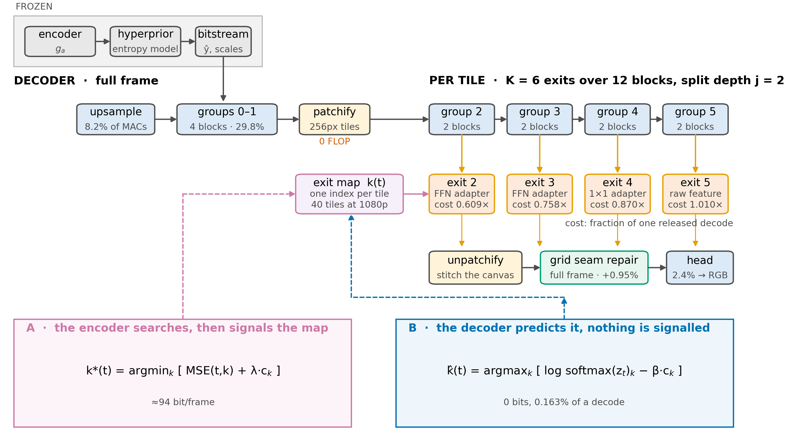
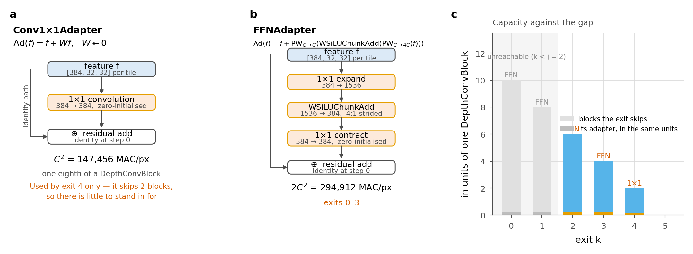
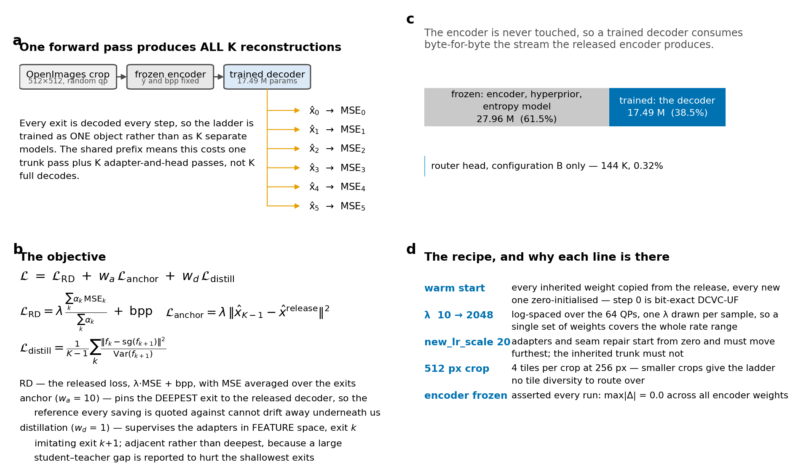

# FLEX-UF, end to end

One document for the whole system: what it is, what was built, how it was
trained, how the two routing configurations differ, and how the tiling artefact
was handled. Every number here is measured and points at the script that
produced it. Where a number was wrong earlier, the correction is stated rather
than quietly applied.

The other documents go deeper on single topics — [01 experiment
plan](01-experiment-plan.md), [02 architecture](02-architecture.md), [03
results](03-results.md), [04 open questions](04-open-questions.md), [05 A vs
B](05-decision-ab.md), [06 CVPR plan](06-cvpr-plan.md), [07 the seam](07-seam.md).
This one is the map.

---

## 1. The idea in one paragraph

DCVC-UF's intra decoder spends the same 453.5 GMAC on every 1080p frame no
matter what is in it. A flat blue sky and a page of text cost identically.
FLEX-UF cuts the frame into tiles and lets each tile leave the decoder's trunk
early, at whichever of K exits is deep enough for *that* tile. The encoder is
never touched, so the bitstream is the released one. What changes is only how
much of the decoder each region of the picture is worth running.



Two things make this harder than it sounds, and they are the two halves of this
project: **cutting the frame into tiles damages the picture** (§5), and
**something has to decide which tile leaves where** (§6).

---

## 2. What we inherited, and where the compute actually sits

The released decoder is one upsample, twelve `DepthConvBlock`s, and a head:

| stage | share of decode MACs |
|---|---|
| `ResidualBlockUpsample` 256→384 | 8.16% |
| 12 × `DepthConvBlock` 384→384 | **89.44%** |
| head `DepthConvBlock` 384→192 + PixelShuffle(8) | 2.40% |

Almost everything is in the twelve blocks, which is why the ladder is built
across them. Inside one block, at C = 384:

| operator | MAC/pixel | share of the block |
|---|---|---|
| block total, `8C² + 9C` | 1,183,104 | 100% |
| the 3×3 depthwise, `9C` | 3,456 | **0.29%** |

That 0.29% is the only operator in the whole trunk with any spatial extent. It
is the single most useful fact in this project: it is why the seam exists at all,
why the adapters are pointwise on purpose, and why canvas coupling (§5.5) is
affordable.

---

## 3. The ladder

`K = 6` exits over the 12 blocks, 2 blocks per exit. A **split depth** `j = 2`
means groups 0 and 1 (4 blocks) run **full frame** for every tile, and groups
2…5 run **per tile** on the shrinking set of tiles still climbing.

Tiles are 256×256 RGB, which is 32×32 in feature space — 40 tiles per padded
1080p frame.

| exit k | blocks it skips | adapter | cost, in released decodes |
|---|---|---|---|
| 2 | 6 | FFN | 0.581 |
| 3 | 4 | FFN | 0.730 |
| 4 | 2 | 1×1 | 0.870 |
| 5 | 0 | none — raw feature | **1.0095** |

Two consequences that are easy to get wrong:

- **Exits 0–2 all cost the same.** The map is clamped to `k ≥ j`, so the first
  three rungs are the same rung. The usable ladder has four distinct costs.
- **The deepest exit costs 1.0095, not 1.0**, because it still pays grid seam
  repair. Every saving in this repository is therefore reported against the
  **release's 1.0**, in a field called `saving_pct_vs_release`. Dividing by our
  own 1.0095 instead inflates every headline by 0.62–0.75 points and hides the
  seam-repair tax inside the figure that is supposed to be net of it.

The **architectural ceiling** is `100·(1 − c_j)` = **41.9%** for this ladder. It
is a bound on cost, not a reachable operating point: every tile at the shallowest
rung costs far more dB than any budget allows.

---

## 4. Inside the exit adapters

A tile that leaves at exit k hands a feature to a head that was fitted to a
*deeper* feature. The adapter is the correction. Both kinds are **entirely
pointwise**, which is deliberate — a 1×1 has no receptive field, so no adapter
adds any tile-boundary penalty.



**Conv1×1Adapter** — `Ad(f) = f + Wf`, `W` zero-initialised. C² = 147,456 MAC/px,
one eighth of a block.

**FFNAdapter** — `Ad(f) = f + PW_{C→C}(WSiLUChunkAdd(PW_{C→4C}(f)))`, the last
1×1 zero-initialised. 2C² = 294,912 MAC/px. This is the same operator sequence as
the FFN inside a `DepthConvBlock`, which is the 74.8% of every block an early
exit gives up.

Zero-init on the last layer matters twice over: at step 0 every adapter is
exactly the identity, so the deepest exit is bit-exact released DCVC-UF
(`tests/test_reference_is_the_release.py`, `max|diff| = 0.0` at qp 0/32/63), and
every shallow exit starts from "the decoder as it is" rather than from noise.

The **`scaled`** rule assigns capacity to the size of the gap: exits skipping 4
blocks or more get the FFN, the rest get the 1×1. Exit 2 stands in for six
skipped blocks, exit 4 for two — asking one 1×1 to do both jobs is a
three-order-of-magnitude mismatch. The bill is real and charged: an exit-2 tile
saves 6 blocks *minus 0.25*, not 6.

---

## 5. The seam, which cost more than the entire budget

Cutting the frame into tiles is not free. Below is one 1080p frame decoded twice
from the **same bitstream**, with the same weights, every tile at full depth —
nothing about the ladder switched on. The only difference is that the right-hand
decode was tiled.


The grid is the tile lattice, drawn onto the picture by the decoder itself.

### 5.1 Where it comes from

A 3×3 depthwise at position (i, j) computes `Σ w[u,v]·f[i+u, j+v]`. Decoded
full-frame those neighbours are real; decoded per tile they do not exist, and the
kernel is handed whatever the padding rule invents. Each convolution pushes the
contamination one ring inward, so with `b` per-tile blocks on a tile of side `F`
the corrupted fraction is `1 − ((F−2b)/F)²` — **0.750** at the shipped `F = 32`,
`b = 8`. This is not a thin line of bad pixels; it is a structured error across
most of the tile.

*(The small-`b` approximation `≈4b/F` appears in older notes. It gives 1.000
here against the exact 0.750. Use the exact form.)*

### 5.2 How it is actually fixed — and it is mostly not by a network


Measured on 40 CTC sequences with the **untrained warm start**, so nothing but
geometry is in the number:

| step, at qp 63 | dB below the release |
|---|---|
| 256 px tiles, zeros padding — stock behaviour | 0.652 |
| → replicate padding | **0.216** |
| → after training | **0.058** |

(One script, one reference, one frame set — `scripts/seam_vs_qp.py`, 40
sequences. The independent `ctc_seam_ablation.py` on 80 frames gives 0.677 and
0.218, so the two agree.)

Tile size is the other free lever. The damage scales with the tile **perimeter**,
so doubling the side should roughly halve it, and under zeros padding — the one
row the §5.3 bug never touched — it does: 1.167 dB at 128 px against 0.548 at
256 px, a ratio of 0.47 against the predicted 0.50. The corresponding ratio for
replicate cannot be quoted yet: the 128 px table needs re-measuring against a
clean reference first.

The two decisive steps cost **nothing in compute**. Tile size is free — a tiled
decode's MAC count does not depend on it at all; what it costs is routing
granularity (40 tiles at 256 px against 160 at 128 px). Padding is free by
construction.

And the largest factor of all is **training**: 0.218 → 0.058. The adapters and
the trunk learn to live with replicate's residual. No module removes as much
seam as simply training the ladder with the seam present.

Panel b of the figure is the part that matters for reading every other result:
the floor is charged **inside** the 0.1 dB budget, and at qp 63 it consumes
**58%** of it before a single tile has exited early. That is the mechanism behind
savings falling from 34% at qp 0 to 21% at qp 63.

### 5.3 Padding is an estimator

Padding is not a formatting detail; it is an estimator of the neighbour the tile
cannot see, and the seam penalty is that estimator's error.

| mode | estimate of `x[−1]` | assumes |
|---|---|---|
| zeros | `0` | the signal is centred at zero |
| replicate | `x[0]` | local constancy — a zeroth-order hold |
| linear | `2x[0] − x[1]` | a locally linear signal |
| arls | `a·x[0]`, `a` fitted per channel | an AR(1) process (arXiv:2502.12300) |

The measured ranking is in [07 — the seam](07-seam.md). Two findings survive:
a **higher-order estimator is worse** (extrapolating a gradient past a boundary
amplifies the noise on that boundary; assuming constancy does not), and **arls
wins on quality and loses on cost** — it was implemented, measured at +10.7% of
decode wall-clock for ~0.02 dB, and dropped.

> **Correction, 18 Aug.** The padding table published in `07-seam.md` was
> measured against a contaminated reference. `ctc_seam_ablation.py` installed the
> padding wrapper on the decoder's trunk groups and then computed its reference
> with `forward_full`, which runs those same modules — so the full-frame baseline
> was padded with the mode under test too. On one frame at qp 63 that moved the
> reference by −0.186 dB and deflated the measured seam from 0.265 to 0.079. The
> `zeros` row was unaffected (wrapping with zeros is a no-op), which is exactly
> why the bug survived: the one row that could be cross-checked was the one row
> that was right. Fixed; the tables above are the re-measurement, and two
> independent scripts now agree on them.

### 5.4 Grid seam repair, and what it is actually worth

The one learned component. A translation-invariant 3×3 over the stitched canvas
would have to *infer* which pixels sit on a boundary and would apply the same
correction to the clean interior. But the lattice is not unknown — `unpatchify`
lays tiles on a fixed grid from the origin, identically at training and
inference. So the correction is gated by position *within* a tile.


```
Repair(f) = f + G[i mod P, j mod P] · PW( WSiLU( DW3×3(f) ) )
```

`G` is P×P = 32² = 1024 scalars shared across all 384 channels — 0.0007% of the
parameters — initialised at `exp(−d/τ)` so the gate starts on the seam and
training refines it. `PW` is zero-initialised, so the module is exactly the
identity at step 0. It runs **once on the whole frame after stitching**, never
per tile: only there does a 3×3 finally see across a boundary instead of into
padding. Cost: **0.95% of the decode**.

Panel b is the gate as actually trained. It did learn the right shape — 0.76 on
the boundary ring — but it never switches off inside: **0.145 in the interior**,
applied to 94% of the pixels.

Panel c is what that does. Splitting the per-pixel error by distance from the
nearest tile boundary, repair ON against OFF at qp 63:

| band (px) | share of pixels | change in MSE |
|---|---|---|
| 0–4 | 6.2% | **−0.27%** |
| 4–16 | 17.3% | +0.05% |
| 16–64 | 51.6% | +0.04% |
| 64–128 | 25.0% | +0.04% |

It helps on the ring and hurts everywhere else. And the ceiling is the decisive
number: even with a **perfect** gate — zero correction in the interior, the ring
gain unchanged — the most it could earn is

```
0.062 × 0.000047 × 0.0027 / 4.30e-5  =  1.8e-4  →  ≈ 0.0008 dB
```

for 0.95% of the decode. `arls` was rejected at 0.019 dB for 10.7% of decode, i.e. 0.0018
dB per point; grid repair is at 0.0020 dB per point at best.[^arls] **It is on the wrong
side of the rule that rejected arls, and tightening the gate cannot save it,
because there is almost nothing left to win.**

[^arls]: Re-measured after the reference bug in §5.3: `arls` beats replicate by
    0.0207 dB at qp 63 on all 40 sequences, against 0.0191 before, i.e. 0.0019 dB
    per point of decode either way. The rejection stands unchanged, and so does
    grid repair's own 0.0008 dB ceiling, which was measured directly against a
    clean reference.

One caveat keeps this from being a verdict: the module was trained jointly, so
switching it off at inference is not the same as training without it. The clean
test is a run with `seam_repair=none`, and none of the six live runs is that.

### 5.5 Canvas coupling — implemented, measured, not used

If the cause is a 3×3 meeting invented values, the complete fix is to give it the
real neighbour, and only for the 3×3 — the 0.29% of the block that needs it.
`CanvasCoupler` does exactly that.

- cost: **+0.032%** of the decode at 256 px — thirty times cheaper than grid repair
- at uniform depth, tiled against full-frame: `max|difference| = 0.0`. The seam
  does not shrink; it stops existing.
- under routing, what remains is only the boundary between tiles that chose
  *different* depths — where the neighbour is real, merely shallower.

**But `tile_coupling = False` in all six runs.** Every number in this repository
uses replicate padding plus grid repair. Coupling is an available option and not
what these results describe. On the evidence in §5.4 the next configuration
should be `tile_coupling=True, seam_repair=none`.

---

## 6. Who decides where each tile exits

The ladder is useless without an exit map. There are exactly two places it can
come from, and the project keeps both because they answer different questions.


**A — the encoder searches and signals the map.** The encoder holds the source,
so for each tile it decodes all K exits, measures the true error, and takes the
optimum `k*(t) = argmin_k [MSE(t,k) + λ·c_k]`, with λ bisected per frame to land
on the budget. This is not an estimate; it is the oracle. It costs the *encoder*
about 1.21 decodes per frame and adds **≈94 bits/frame** to the stream — 0.008 to
0.020% of the bitrate. It needs a new bitstream field, so both ends must agree.
This is also the conventional choice: HEVC and VVC signal block partitioning,
prediction mode and transform tree rather than having the decoder guess them.

**B — the decoder predicts it and nothing is signalled.** The decoder never sees
the source, so the true MSE is not merely hard to estimate — it is *absent from
the input*. A `StemRouterHeadV2` (144,024 params) reads the stem map, `ŷ`, the
entropy-model scales and qp, and scores exits; the decision is
`k̂(t) = argmax_k [log softmax(z_t)_k − β·c_k]`, β bisected like λ. Nothing is
added to the file — it stays **byte-identical** to a stock stream — and it is
deployable by a decoder vendor alone. The head costs **0.163%** of a decode,
charged inside every B number reported.

### What the difference costs

Same checkpoint, same 40 sequences, at the 0.1 dB budget:

| qp | 0 | 16 | 32 | 48 | 63 |
|---|---|---|---|---|---|
| **A** signalled | 34.04% | 30.70% | 26.76% | 23.62% | 20.80% |
| **B** best available router | 30.07% | 27.44% | 23.93% | 22.27% | 19.30% |
| gap | 3.96 | 3.26 | 2.82 | 1.35 | 1.50 |

And the gap depends strongly on how tight the budget is — panel c. At 0.3 dB it
falls to 0.16–0.95 points, and at 0.5 dB it is **exactly 0.16 at every rate below
qp 63**, which is precisely the router's own 0.163% of compute. When the ladder
has room, prediction is free; the price of an unchanged bitstream is paid only
when the budget is tight.

### How the router is trained, and how it fails

Against a **frozen** decoder, with a cost-sensitive cross-entropy to the oracle's
choice — each tile weighted by the regret of picking wrong, so capacity goes
where the decision matters and ties are left alone — plus loss-free load
balancing (arXiv:2408.15664): a per-exit bias nudged by usage rather than by a
gradient, and balanced toward the **oracle's** mix rather than toward uniform,
because at a high λ the oracle genuinely does send everything to one exit.

Trained this way it reaches 0.848–0.923 held-out agreement with the oracle and
meets the budget at every rate.

Trained **jointly** with a moving decoder it can collapse. Three routers, three
outcomes, all measured:

| router | outcome |
|---|---|
| BEST, joint | collapsed to a qp-dependent constant; agreement 0.000 at qp 63 |
| FINE12, joint | **did not collapse** — budget met at every rate |
| retrained against a frozen decoder | 0.848–0.923 agreement, budget met everywhere |

So "the router collapses" is false as a general statement. Joint training is not
automatically fatal, and why BEST's collapsed and FINE12's did not is open — they
differ in K, j, tile size and adapter kind, so the comparison isolates nothing.

---

## 7. How it is trained



The encoder, hyperprior and entropy model — 27.96 M of the 45.45 M parameters —
are **frozen**, asserted every run with `max|Δ| = 0.0`. Only the 17.49 M decoder
(38.5%) trains. That is what makes the whole comparison legitimate: the trained
decoder consumes byte-for-byte the stream the released encoder produces, so the
released decoder and ours can be run on the *same latent* and the difference is
the synthesis and nothing else.

One forward pass produces all K reconstructions — the ladder is trained as one
object, not as K models — and the objective is three terms:

```
L  =  L_RD  +  w_a · L_anchor  +  w_d · L_distill
```

- **`L_RD` = λ·(Σ α_k MSE_k / Σ α_k) + bpp** — the released loss, with the MSE
  averaged over exits.
- **`L_anchor` = λ·‖x̂_{K−1} − x̂_release‖²**, `w_a = 10`. This pins the deepest
  exit to the released decoder. Without it, the reference every saving is quoted
  against drifts away underneath the measurement. Measured drift on the shipped
  run: −0.003 dB at qp 0 to −0.024 dB at qp 63.
- **`L_distill`**, `w_d = 1` — supervises adapters in **feature** space, exit k
  imitating exit k+1. Pixels are a 3-channel target at the far end of a head that
  mixes 384 channels down to 192 and shuffles by 8; that is a long, lossy path
  for a gradient, and the adapter's job is stated much more directly as "produce
  what the skipped blocks would have produced". *Adjacent* rather than deepest,
  because the multi-exit self-distillation literature reports that too large a
  student–teacher gap hurts the shallowest exits. Normalised by the teacher's own
  variance so the weight means the same thing at every exit and every qp.

Recipe: warm start from the release (inherited weights copied, new ones
zero-initialised, so step 0 is bit-exact), λ log-spaced 10 → 2048 over the 64 QPs
with one λ drawn per sample so a single set of weights covers the whole rate
range, `new_lr_scale 20` on the newly-initialised modules only, 512 px crops (4
tiles per crop at 256 px — smaller crops give the ladder no tile diversity to
route over), effective batch 8.

The training loss is **not** a useful convergence signal here: it is flat from
step 5,000 and correlates 0.97 with the batch's bitrate, because λ·MSE + bpp
tracks the content of the crop as much as the state of the model. Per-exit
quality on held-out frames is the signal that answers "has it converged", and it
is still climbing at four epochs.

---

## 8. What it delivers

At the 0.1 dB budget, 40 CTC sequences, signalled configuration:

| qp | 0 | 16 | 32 | 48 | 63 |
|---|---|---|---|---|---|
| compute saved vs the release | 34.0% | 30.7% | 26.8% | 23.6% | 20.8% |


Read against the rate axis a codec paper is normally read on (panel a), the
quality difference the whole method spends is invisible; panel b expands it.

Three things a reviewer will ask, answered:

- **Is the bitrate unchanged?** In configuration B, byte-identically. In A, the
  coded payload is identical and a ~94 bit/frame map field is added — 0.008–0.020%
  — and it is included in every bpp reported.
- **Is the deepest exit still DCVC-UF?** Bit-exact at step 0; after training it
  has drifted by −0.003 to −0.024 dB, measured every checkpoint by
  `scripts/anchor_drift.py`.
- **Does the MAC saving show up as time?** Partly. The MAC model overstates the
  wall-clock gain by 2–3×; the cause is per-group bookkeeping (32% of the loop),
  and a sorted-tile execution prototype recovers 23–37% of it, verified
  bit-identical (`scripts/sorted_exec.py`). It has not been landed in
  `decoder.py` because `tile_gate` is indexed by original tile id and a pixel test
  would not catch a gradient bug.

---

## 9. How everything here is measured

Getting this wrong has produced more corrections in this project than any
modelling mistake, so it is stated explicitly.

- **The reference is always the released decoder's FULL-FRAME decode of the same
  latent.** Our side is tiled. The seam is therefore *inside* every dB reported,
  never excluded.
- **dB is a full-frame quantity.** Per-tile MSEs exist only so the Lagrangian
  argmin can be per tile; they are averaged over all tiles of the frame, which is
  the frame's MSE.
- **Per frame, not per single image.** 40 CTC sequences, 1–2 frames each; every
  result JSON records exactly which sequences it saw and which of the 53 were not
  on disk.
- **Two dB conventions exist** — pooled (all tiles of all frames into one MSE)
  and per-frame (a decibel per frame, then averaged). They differ by 0.023–0.033
  dB. Everything headline is per-frame, the convention `test_video.py` uses.
- **Two quality metrics exist** — the routed curve uses an RGB MSE ratio on the
  padded frame; the seam tables and anchor use `psnr_611_420`, the 6:1:1 weighted
  YUV 4:2:0 PSNR DCVC-UF reports. Measured against each other on the same
  decodes, they agree within 0.003 dB across the whole qp range. That is now a
  measurement rather than an assumption.
- **Savings divide by the release's 1.0**, never by our deepest exit's 1.0095.

---

## 10. What is not settled

The full list is in [04 — open questions](04-open-questions.md). The four that
matter most:

1. **Why does `CONTROL` degrade over its second epoch?** The phenomenon is solid
   and reproducible — damage concentrated in the shallow exits, scaling with rate,
   present on held-out data too. The mechanism has been asserted and withdrawn
   three times.
2. **Is `K=6, j=2` the right ladder?** FINE12's ceiling is 50.3% against 41.9%,
   and it has produced no measured advantage yet.
3. **Does the gain continue past four epochs?** Still climbing at every
   checkpoint with more than one measurement.
4. **Seam repair versus canvas coupling.** §5.4 says the module cannot pay for
   itself and §5.5 says the alternative is thirty times cheaper and exact. The
   experiment that settles it has not been run.

A note on how to read all of this: five mechanism claims in this project have
been asserted and then refuted by their own follow-up measurement. The pattern is
recorded in `DECISIONS.md` rather than edited away, and predictions are now
written down *before* the test that could falsify them.

---

## Reproducing the figures here

```bash
python scripts/system_figs.py          # pipeline, adapters, seam module, training, A/B
python scripts/seam_vs_qp.py --device cuda:0    # the seam-vs-rate measurement
python scripts/seam_vs_qp_figure.py
python scripts/ctc_seam_ablation.py --patch 16  # the padding table (clean reference)
python scripts/seam_problem.py --device cuda:0  # the frame-scale error map
```
