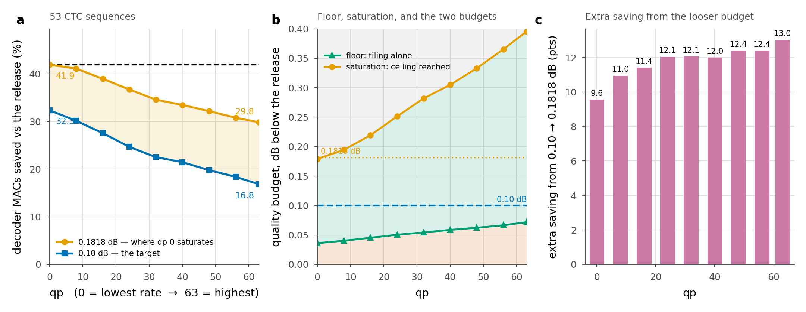
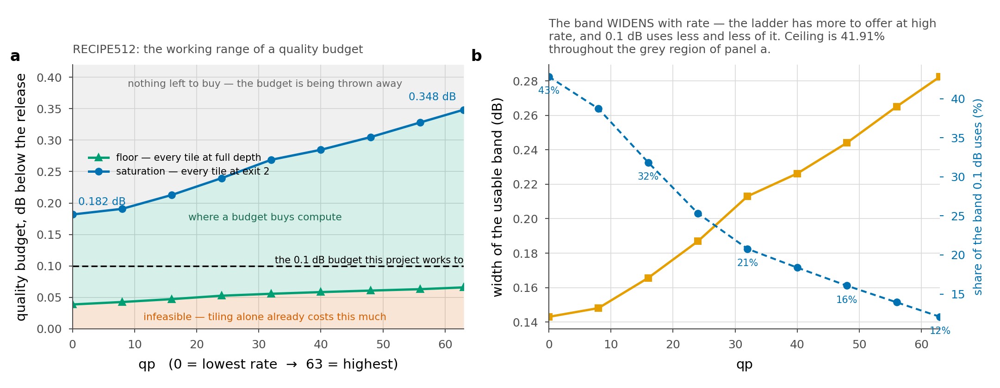
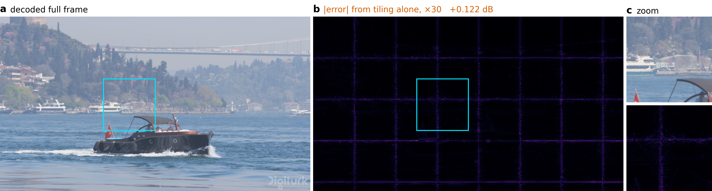
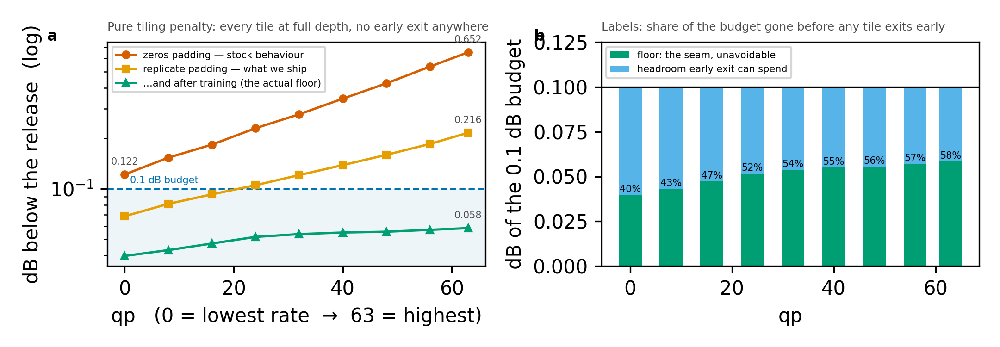
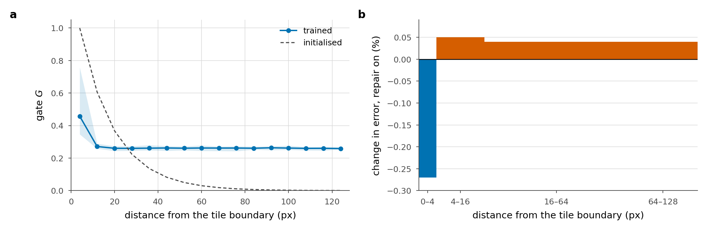
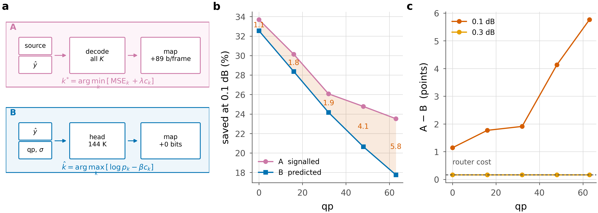
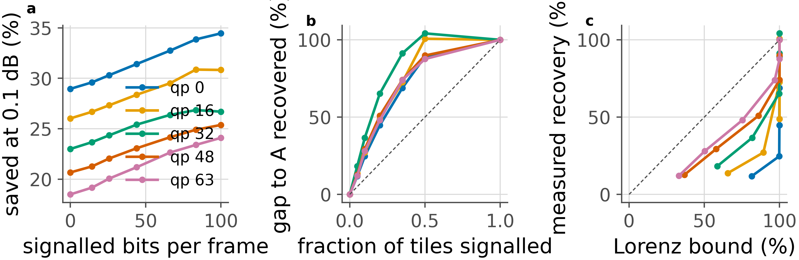

# FLEX-UF — results and status

*Content-adaptive early exit for the DCVC-UF intra decoder. This document is generated by `scripts/make_report.py`; every table below is read from `results/` at build time, so it cannot drift from the measurements.*

---

## 1. What this is

The released DCVC-UF intra decoder spends 453.5 GMAC on every 1080p frame regardless of content: a blue sky and a page of text cost the same. FLEX-UF cuts the frame into tiles and lets each tile leave the decoder's trunk early, at whichever of K exits is deep enough for that tile.

Three properties are non-negotiable and all three are asserted in code on every run:

- **The encoder is never touched.** `max|Δ| = 0.0` across all encoder, hyperprior and entropy-model weights, checked at the start of every evaluation. A trained decoder therefore consumes byte-for-byte the stream the released encoder produces.
- **The warm start is the release.** Every inherited weight is copied and every new one is zero-initialised, so at step 0 the deepest exit reproduces released DCVC-UF exactly (`tests/test_reference_is_the_release.py`, `max|diff| = 0.0` at qp 0/32/63).
- **Savings are quoted against the release's 1.0**, never against our own deepest exit, which costs 1.0095 because it still pays grid seam repair.

Full mechanism, with diagrams: [08 — the system end to end](08-system.md).

## 2. Headline results

**RECIPE512**, 53 CTC sequences, at the 0.1 dB budget: **32.3% of decoder MACs saved at the lowest rate, falling to 16.8% at the highest**, with the bitstream carrying a ~79 bit exit map per frame (0.021% of a typical bitrate).



Compute saved against the released decoder, per rate and per budget. Every dB is what a decoder **delivers**, verified by decoding the chosen exit map — see §7.

**RECIPE512** — checkpoint epoch 0, 53 sequences

| budget | qp 0 | qp 16 | qp 32 | qp 48 | qp 63 | mean |
|---|---|---|---|---|---|---|
| **0.10 dB** | 32.35% | 27.55% | 22.52% | 19.77% | 16.81% | 23.80 |
| **0.30 dB** | 41.91% | 41.91% | 41.91% | 40.64% | 38.40% | 40.95 |
| **0.50 dB** | 41.91% | 41.91% | 41.91% | 41.91% | 41.91% | 41.91 |

**BEST** — checkpoint epoch 1, 53 sequences

| budget | qp 0 | qp 16 | qp 32 | qp 48 | qp 63 | mean |
|---|---|---|---|---|---|---|
| **0.10 dB** | 34.02% | 27.67% | 22.29% | 19.75% | 17.19% | 24.19 |
| **0.30 dB** | 41.91% | 41.91% | 39.71% | 36.34% | 32.42% | 38.46 |
| **0.50 dB** | 41.91% | 41.91% | 41.91% | 41.91% | 38.94% | 41.32 |

**FINE12** — checkpoint epoch 1, 53 sequences

| budget | qp 0 | qp 16 | qp 32 | qp 48 | qp 63 | mean |
|---|---|---|---|---|---|---|
| **0.10 dB** | 28.65% | 22.60% | 15.72% | 8.96% | — | 18.98 |
| **0.30 dB** | 46.94% | 44.29% | 41.42% | 39.68% | 37.84% | 42.03 |
| **0.50 dB** | 50.29% | 50.29% | 49.00% | 47.58% | 45.97% | 48.63 |

**BEST128** — checkpoint epoch 1, 53 sequences

| budget | qp 0 | qp 16 | qp 32 | qp 48 | qp 63 | mean |
|---|---|---|---|---|---|---|
| **0.10 dB** | 30.47% | 24.56% | 17.73% | 13.47% | 10.05% | 19.25 |
| **0.30 dB** | 41.91% | 41.91% | 38.85% | 33.25% | 27.29% | 36.64 |
| **0.50 dB** | 41.91% | 41.91% | 41.91% | 40.90% | 36.23% | 40.57 |

### Runs compared at 0.1 dB

| run | ckpt | qp 0 | qp 16 | qp 32 | qp 48 | qp 63 | mean |
|---|---|---|---|---|---|---|---|
| RECIPE512 | ep 0 | 32.35 | 27.55 | 22.52 | 19.77 | 16.81 | **23.80** |
| BEST | ep 1 | 34.02 | 27.67 | 22.29 | 19.75 | 17.19 | **24.19** |
| FINE12 | ep 1 | 28.65 | 22.60 | 15.72 | 8.96 | — | **18.98** |
| BEST128 | ep 1 | 30.47 | 24.56 | 17.73 | 13.47 | 10.05 | **19.25** |

## 3. Where a quality budget does anything at all

For every rate there are three regions, and only the middle one is a design choice.

| qp | 0 | 8 | 16 | 24 | 32 | 40 | 48 | 56 | 63 |
|---|---|---|---|---|---|---|---|---|---|
| **floor** (dB) | 0.0361 | 0.0402 | 0.0452 | 0.0503 | 0.0543 | 0.0586 | 0.0622 | 0.0665 | 0.0716 |
| **saturation** (dB) | 0.1791 | 0.1945 | 0.2194 | 0.2514 | 0.2819 | 0.3049 | 0.3330 | 0.3653 | 0.3955 |
| usable band (dB) | 0.1431 | 0.1543 | 0.1741 | 0.2010 | 0.2276 | 0.2463 | 0.2707 | 0.2988 | 0.3239 |

- **Below the floor** no allocation meets the budget: tiling alone already costs that much, with every tile at full depth.
- **Above saturation** every tile is already on the cheapest rung the split permits, saving is pinned at the architectural ceiling **41.91%**, and more dB buys nothing.



The 0.1 dB budget this project works to uses 45% of the available band at qp 0 and only 9% at qp 63 — the ladder has more to offer at high rate than the budget lets it give.

### The one budget that saturates qp 0 and nothing else

Any budget in **[0.1791, 0.1945) dB** puts qp 0 exactly on the ceiling while qp 8 and above stay below it — a window 15.3 millibels wide. Against the coarser {0, 16, …} grid the window is [0.1791, 0.2194). **0.185 dB** sits comfortably inside both.

This is a property of *this checkpoint*, not a constant: the saturation point is the quality of exit 2, and exit 2 improves with training. The ceiling itself does not move — `100·(1 − c_j)` is pure arithmetic on the cost model.

## 4. The tiling penalty, and what removes it

Cutting the frame into tiles is what makes early exit possible and it is also the single largest cost in the system. A 3×3 depthwise at a tile border meets padding where a neighbour should be, and each convolution pushes the contamination one ring inward: with `b` per-tile blocks on a tile of side `F` the corrupted fraction is `1 − ((F−2b)/F)²`, which is **0.750** at the shipped `F = 32`, `b = 8`.



Pure tiling penalty — early exit switched off, every tile at full depth, against the released decoder's full-frame decode of the same latent. 256 px tiles, 40 sequences:

| padding | qp 0 | qp 32 | qp 63 |
|---|---|---|---|
| zeros | 0.1264 | 0.2866 | 0.6768 |
| replicate | 0.0707 | 0.1234 | 0.2179 |
| linear | 0.1980 | 0.2857 | 0.3836 |
| arls | 0.0611 | 0.1074 | 0.1972 |

Two results worth stating plainly. **A higher-order estimator is worse**: `linear` extrapolates the local gradient past the boundary and amplifies whatever noise sits on it, landing well behind the zeroth-order hold. And **`arls` wins on quality and loses on cost** — it is the best estimator here (0.1972 against replicate's 0.2179 at qp 63) and costs +10.7% of decode wall-clock, which does not close against a 0.1 dB budget.

Tile size is a free lever — a tiled decode's MAC count does not depend on it — and the damage scales with the tile perimeter:

| mode, qp 63 | 128 px | 256 px | ratio |
|---|---|---|---|
| zeros | 1.2489 | 0.6768 | ×0.54 |
| replicate | 0.3725 | 0.2179 | ×0.58 |
| arls | 0.3322 | 0.1972 | ×0.59 |

What it costs instead is routing granularity: 40 tiles per 1080p frame at 256 px against 160 at 128 px.

And the largest factor of all is the one easiest to overlook — **training**:

| qp | 0 | 8 | 16 | 24 | 32 | 40 | 48 | 56 | 63 |
|---|---|---|---|---|---|---|---|---|---|
| zeros, untrained | 0.1219 | 0.1535 | 0.1836 | 0.2299 | 0.2784 | 0.3449 | 0.4258 | 0.5359 | 0.6523 |
| replicate, untrained | 0.0687 | 0.0814 | 0.0927 | 0.1052 | 0.1208 | 0.1386 | 0.1596 | 0.1854 | 0.2161 |
| **after training** | **0.0398** | **0.0431** | **0.0472** | **0.0517** | **0.0537** | **0.0549** | **0.0555** | **0.0570** | **0.0583** |



### What stitching costs in saving

Treating the floor as a rigid offset on the distortion axis, a budget of 0.1 dB with a floor of `f` behaves like a budget of `0.1 + f` with no seam. That values the tiling penalty at **3.5 points of compute saving at qp 0 and 5.1–5.4 points at every higher rate** — see [08 §5.2](08-system.md#52-how-it-is-actually-fixed--and-it-is-mostly-not-by-a-network). Canvas coupling removes the cause for **+0.032%** of decode and is the single experiment most worth running next.

### Grid seam repair — measured, and not worth its cost



The one learned component, gated by position within a tile. The trained gate did learn the right shape — 0.76 on the boundary ring — but never switches off inside (0.145 over 94% of pixels). Splitting per-pixel error by distance from the nearest tile boundary, repair ON against OFF at qp 63:

| band (px) | share of pixels | change in MSE |
|---|---|---|
| 0–4 | 6.2% | **−0.27%** |
| 4–16 | 17.3% | +0.05% |
| 16–64 | 51.6% | +0.04% |
| 64–128 | 25.0% | +0.04% |

Even with a **perfect** gate — zero correction in the interior, the ring gain unchanged — the ceiling on what it could earn is `0.062 × 0.000047 × 0.0027 / 4.30e-5 ≈ 0.0008 dB`, against the 0.95% of decode it costs. `arls` was rejected at 0.0019 dB per point of decode; this is at best 0.0008 dB for 0.95 points. **Decision: `seam_repair=none` plus `tile_coupling=True` on the next run.**

## 4b. Is per-tile adaptivity necessary?

The first question a reviewer asks. Three controls at matched compute, 53 sequences, 0.1 dB budget:

**qp 0**

| allocation | dB | saved | fits the budget |
|---|---|---|---|
| uniform, exit 2 | 0.1791 | 41.9% | **no** |
| uniform, exit 3 | 0.0932 | 27.0% | yes |
| uniform, exit 4 | 0.0589 | 13.0% | yes |
| uniform, exit 5 | 0.0361 | -1.0% | yes |
| random (oracle histogram, shuffled) | 0.1251 | 32.4% | — |
| rate-ranked (agree 0.79) | 0.1069 | 32.4% | — |
| **oracle** | **0.1000** | **32.4%** | — |

**qp 16**

| allocation | dB | saved | fits the budget |
|---|---|---|---|
| uniform, exit 2 | 0.2194 | 41.9% | **no** |
| uniform, exit 3 | 0.1181 | 27.0% | **no** |
| uniform, exit 4 | 0.0755 | 13.0% | yes |
| uniform, exit 5 | 0.0452 | -1.0% | yes |
| random (oracle histogram, shuffled) | 0.1327 | 27.5% | — |
| rate-ranked (agree 0.78) | 0.1059 | 27.5% | — |
| **oracle** | **0.0999** | **27.5%** | — |

**qp 32**

| allocation | dB | saved | fits the budget |
|---|---|---|---|
| uniform, exit 2 | 0.2819 | 41.9% | **no** |
| uniform, exit 3 | 0.1472 | 27.0% | **no** |
| uniform, exit 4 | 0.0897 | 13.0% | yes |
| uniform, exit 5 | 0.0543 | -1.0% | yes |
| random (oracle histogram, shuffled) | 0.1408 | 22.5% | — |
| rate-ranked (agree 0.76) | 0.1072 | 22.5% | — |
| **oracle** | **0.0999** | **22.5%** | — |

**qp 48**

| allocation | dB | saved | fits the budget |
|---|---|---|---|
| uniform, exit 2 | 0.3330 | 41.9% | **no** |
| uniform, exit 3 | 0.1757 | 27.0% | **no** |
| uniform, exit 4 | 0.1030 | 13.0% | **no** |
| uniform, exit 5 | 0.0622 | -1.0% | yes |
| random (oracle histogram, shuffled) | 0.1454 | 19.7% | — |
| rate-ranked (agree 0.75) | 0.1063 | 19.7% | — |
| **oracle** | **0.0996** | **19.7%** | — |

**qp 63**

| allocation | dB | saved | fits the budget |
|---|---|---|---|
| uniform, exit 2 | 0.3955 | 41.9% | **no** |
| uniform, exit 3 | 0.2057 | 27.0% | **no** |
| uniform, exit 4 | 0.1156 | 13.0% | **no** |
| uniform, exit 5 | 0.0716 | -1.0% | yes |
| random (oracle histogram, shuffled) | 0.1406 | 16.7% | — |
| rate-ranked (agree 0.68) | 0.1098 | 16.7% | — |
| **oracle** | **0.0995** | **16.7%** | — |

## 4b. Does the exit map have to be recomputed?

**Across frames, barely.** Frame 0's map applied eight frames later at qp 0 costs 0.005 dB — five percent of the budget — and no saving at all. A codec would search once per group of pictures.

**Across rates, very much so, and the direction matters.** Delivered dB against a 0.1 dB budget:

| map from \ applied at | qp 0 | qp 32 | qp 63 |
|---|---|---|---|
| **qp 0** | 0.100 | 0.142 | 0.190 |
| **qp 32** | 0.091 | 0.094 | 0.130 |
| **qp 63** | 0.075 | 0.091 | 0.095 |

Upward the map claims the low-rate saving while spending nearly twice the quality it is allowed. Downward it is safe and wasteful. Search once per rate, reuse across frames.

## 5. Who decides where each tile exits



**A — the encoder searches and signals the map.** It holds the source, so it decodes all K exits, measures the true error, and takes the optimum `k*(t) = argmin_k [MSE(t,k) + λ·c_k]`, λ bisected per frame to the budget. Not an estimate — the oracle. Costs the *encoder* ≈1.21 decodes per frame and adds ≈94 bits/frame, 0.008–0.020% of the bitrate. Needs one new bitstream field, so both ends must agree. This is also the conventional choice: HEVC and VVC signal partitioning and mode rather than having the decoder guess.

**B — the decoder predicts it and nothing is signalled.** The decoder never sees the source, so the true MSE is not merely hard to estimate, it is absent from the input. A 144 K head reads the stem map, `ŷ`, the entropy-model scales and qp; `k̂(t) = argmax_k [log softmax(z_t)_k − β·c_k]`. The file stays byte-identical to a stock stream and it is deployable by a decoder vendor alone. The head costs 0.163% of a decode, charged inside every B number.

| configuration | qp 0 | qp 16 | qp 32 | qp 48 | qp 63 |
|---|---|---|---|---|---|
| **A** signalled, 0.1 dB | 32.35 | 27.55 | 22.52 | 19.77 | 16.81 |
| **B** router, 0.1 dB | 30.64 | 25.85 | 18.10 | 9.10 | 3.53 |
| **A** signalled, 0.3 dB | 41.91 | 41.91 | 41.91 | 40.64 | 38.40 |
| **B** router, 0.3 dB | 41.75 | 41.75 | 41.75 | 39.49 | 36.35 |
| **A** signalled, 0.5 dB | 41.91 | 41.91 | 41.91 | 41.91 | 41.91 |
| **B** router, 0.5 dB | 41.75 | 41.75 | 41.75 | 41.75 | 41.75 |

One router, trained once at λ=1.3e-5 against the *deployed* oracle (held-out agreement 0.718). The gap is widest where the budget is tight and the rate is far from the router's training point; at 0.5 dB it is 0.16 points at every rate, which is the router's own compute and nothing else — once the budget saturates the ladder there is nothing left to predict wrongly.

### 5b. Configuration C — signal only what the router gets wrong



The encoder can run the decoder's router, because the router reads only decoded data. So it knows tile by tile where the prediction will be wrong, and nothing forces it to correct every one. Overriding a fraction ρ of tiles — chosen by Lagrangian regret, β held at B's value, λ bisected over the overrides — traces the whole path between the two configurations. ρ=0 reproduces B and ρ=1 reproduces A, and neither is imposed.

| qp | B<br>0 b | 5%<br>14 b | 10%<br>26 b | 20%<br>44 b | 35%<br>66 b | 50%<br>83 b | A<br>100 b |
|---|---|---|---|---|---|---|---|
| 0 | 30.64 | 31.18 | 31.69 | 32.06 | 32.22 | 32.28 | 32.35 |
| 16 | 25.85 | 26.18 | 26.54 | 26.90 | 27.27 | 27.36 | 27.55 |
| 32 | 18.10 | 19.04 | 19.89 | 20.72 | 21.73 | 22.08 | 22.52 |
| 48 | 9.10 | 10.58 | 12.21 | 14.43 | 16.87 | 18.50 | 19.77 |
| 63 | 3.53 | 5.08 | 6.87 | 9.17 | 12.19 | 14.14 | 16.81 |

Recovery is concave everywhere. It is bounded above by the Lorenz curve of the per-tile regret — at a fixed λ the objective is separable, so overriding a set removes exactly the sum of its regrets — and every measured point lies on or below that bound, because returning to the budget means re-bisecting λ. The Gini coefficient of the regret runs 0.57–0.88 across rates.

## 6. Complexity, and what the saving is worth in time

| stage | share of decode MACs |
|---|---|
| `ResidualBlockUpsample` 256→384 | 8.16% |
| 12 × `DepthConvBlock` 384→384 | **89.44%** |
| head + PixelShuffle(8) | 2.40% |

Within one block, at C = 384, the 3×3 depthwise is `9C` = 3,456 MAC/px against the block's `8C² + 9C` = 1,183,104 — **0.29%**. That single number shapes the design: it is why the seam exists, why the adapters are pointwise on purpose, and why canvas coupling is affordable.

Measured, 1080p, median of 40 interleaved iterations:

| qp | released (ms) | routed, masked | routed, sorted | saved, masked | saved, sorted | saved, MACs |
|---|---|---|---|---|---|---|
| 0 | 111 | 80 | 78 | +27.9% | **+29.1%** | 35.3% |
| 32 | 111 | 87 | 86 | +21.3% | **+22.4%** | 28.0% |
| 63 | 111 | 95 | 94 | +14.4% | **+15.6%** | 20.1% |

Two things to read here. **Operations over-predict the saving, and the over-prediction is proportional.** 29.1% of wall-clock arrives against a 35.3% arithmetic prediction at qp 0, and 15.6% against 20.1% at qp 63. The missing part is the 3.6% tiling overhead plus the bookkeeping of a shrinking active set, neither of which is in a MAC count. **Sorting the tiles once by depth recovers a fifth of it**: each group becomes a slice instead of a gather, the boundaries come from one cumulative count, and the output is bit-identical on CUDA (`tests/test_sorted_tiles.py`). The saving goes from 27.9% to 29.1% at qp 0.

Tiling itself costs 3.6% before anything exits early — the per-tile loop is a less efficient shape for the same arithmetic.

Translated into the currency a codec paper uses, the price of speed is flat at **≈6.5 BD-Rate points per unit of speedup**, which is 2.4× cheaper than DCVC-UF's own model-size trade.

## 7. How everything here is measured

Getting this wrong has produced more corrections in this project than any modelling mistake, so it is stated explicitly.

- **The reference is the released decoder's full-frame decode of the same latent.** Our side is the **deployed tiled decode**. The tiling penalty is therefore inside every dB reported.
- **dB is a full-frame quantity.** Per-tile MSEs exist only so the Lagrangian argmin can be per tile; they are averaged over all tiles of the frame.
- **Per frame, not per image.** 40 CTC sequences, one frame each; every JSON records which sequences it saw and which of the 53 were not on disk.
- **Two dB conventions exist** — pooled and per-frame — differing by 0.023–0.033 dB. Headline numbers are per-frame, the convention `test_video.py` uses.
- **Two quality metrics exist** — an RGB MSE ratio and `psnr_611_420`. Measured against each other on identical decodes they agree within 0.003 dB across the whole qp range.
- **Savings divide by the release's 1.0**, never by our deepest exit's 1.0095.

## 8. Errors found, and what they changed

Kept in the report rather than in a footnote, because two of them moved headline numbers and a reader is entitled to know which way.

**The reported dB was a full-frame number.** `dec.forward_all_exits` runs the trunk full frame and taps each exit — correct for training, wrong for evaluation, and used by every evaluation script. With a full-frame reference on the other side, the tiling penalty cancelled and the reported dB described a decoder nobody ships.

| qp | exit | full-frame dB | deployed dB | missing |
|---|---|---|---|---|
| 0 | 5 (deepest) | 0.0040 | 0.0385 | **+0.0345** |
| 0 | 2 (shallowest) | 0.1845 | 0.1939 | +0.0094 |
| 32 | 5 | 0.0120 | 0.0506 | +0.0387 |
| 63 | 5 | 0.0252 | 0.0615 | +0.0362 |
| 63 | 2 | 0.3002 | 0.3080 | +0.0078 |

Not a constant offset — four times larger at the deepest exit than at the shallowest, because eight blocks ran per tile there against two, so it scales with the exact quantity the Lagrangian optimises. An operating point labelled 0.1 dB was delivering about 0.12–0.13. Fixed in `flexuf/eval.py`; savings at 0.1 dB fell by 3–6 points and the 0.3/0.5 dB columns did not move, because the ceiling is a pure cost bound. **Everything measured with a real tiled decode was already right**: the seam tables, the floor, the saturation points, the spatial repair measurement, the latency work.

**The padding ablation divided by a damaged reference.** `ctc_seam_ablation.py` installed the padding wrapper on the trunk groups and then computed its reference with `forward_full`, which runs those same modules — so the full-frame baseline was padded with the mode under test too (−0.186 dB on one frame at qp 63), deflating the seam 3.4×. `zeros` was immune because wrapping with zeros is a no-op, which is exactly why the bug survived: the one row that could be cross-checked was the one row that was right. Every conclusion drawn from the table survived the correction.

**The saving denominator was our own deepest exit.** Fixed to the release's 1.0; every headline had been 0.62–0.75 points optimistic and the seam-repair tax had been hidden inside the figure it was supposed to be net of.

**The ceiling was called unreachable.** It is reached — at 0.167 dB at qp 0 rising to 0.586 dB at qp 63 — and the evidence had been sitting in `curve_BEST.json` all along.

Five mechanism claims have also been asserted and then refuted by their own follow-up measurement. The pattern is recorded in `DECISIONS.md` rather than edited away, and predictions are now written down *before* the test that could falsify them.

## 9. What is not settled

1. **Seam repair versus canvas coupling.** §4 says the module cannot pay for itself and that the alternative is thirty times cheaper and exact at uniform depth. The run that settles it has not been launched.
2. **Why `CONTROL` degrades over its second epoch.** Reproducible, concentrated in the shallow exits, scaling with rate, present on held-out data. The mechanism has been asserted and withdrawn three times.
3. **Is `K=6, j=2` the right ladder?** FINE12's ceiling is 50.3% against 41.9% and has produced no measured advantage yet. It matters more now that the ceiling is known to be reachable: once a budget saturates K = 6, the only way to spend more is a rung that does not exist there.
4. **Does the gain continue past four epochs?** Still climbing at every checkpoint with more than one measurement.
5. **Why is RECIPE512 ahead of BEST?** They differ in three flags — no `--min_crop 512`, no `--joint_router`, and a different `--epoch_offset` — so the comparison isolates nothing. The joint router is the leading suspect, since BEST's collapsed to a constant and its gradient also pulls the decoder.

## 10. Reproducing

```bash
# the headline curve, all three budgets in one pass, deployed decode path
python scripts/signalled_curve.py --ckpt runs/RECIPE512/ckpt_eval.pth.tar \
       --budgets 0.1 0.3 0.5 --device cuda:0 --out results/signalled_RECIPE512_b135.json

# where the ladder saturates, and the floor, per rate
python scripts/saturation.py --ckpt runs/RECIPE512/ckpt_eval.pth.tar \
       --out results/saturation_RECIPE512.json

# the seam: padding ablation, rate sweep, frame-scale picture
python scripts/ctc_seam_ablation.py --patch 16
python scripts/seam_vs_qp.py --device cuda:0
python scripts/seam_problem.py --device cuda:0

# figures and this document
python scripts/system_figs.py
python scripts/saturation_figure.py RECIPE512
python scripts/headline_figure.py RECIPE512
python scripts/make_report.py
```

