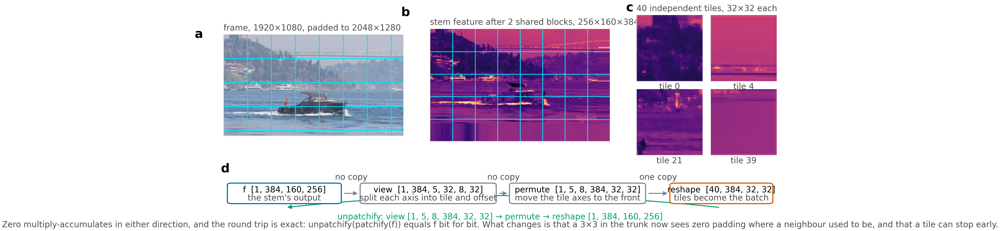
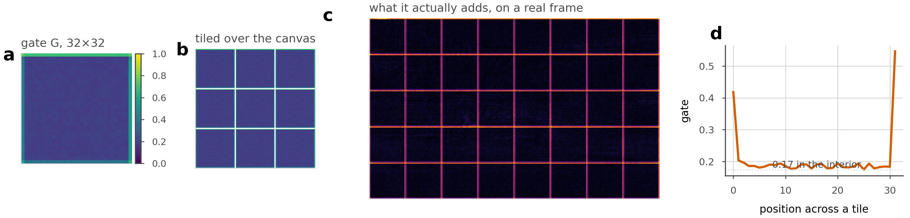
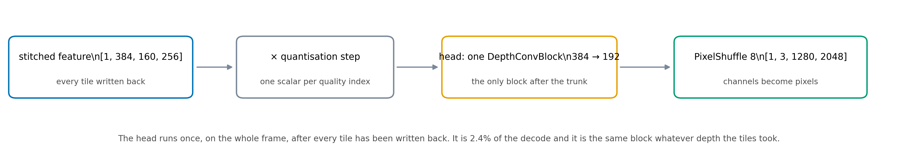

# Inside the FLEX-UF decoder, step by step

Every number and every picture on this page was produced by running the pinned
checkpoint `runs/RECIPE512/ckpt_PAPER.pth.tar` on a real frame, Bosphorus at
1920x1080, quality index 32. Nothing is a sketch. The scripts that made the
figures are named under each one, and they read shapes off the tensors rather
than having them typed in, so this page cannot drift from the code.

The decoder we start from is the intra path of DCVC-UF. It receives a quantised
latent, runs an upsampling stem, twelve `DepthConvBlock`s at 384 channels, and a
head that shuffles channels back into pixels. FLEX-UF changes one thing: after
the first `j` blocks, the frame is cut into tiles and each tile is allowed to
leave the trunk at a different depth.

Contents:

1. [The shapes, before anything happens](#1-the-shapes)
2. [patchify: how a frame becomes 40 independent tiles](#2-patchify)
3. [The trunk, and where a tile is allowed to stop](#3-the-trunk)
4. [unpatchify: putting the tiles back](#4-unpatchify)
5. [Grid seam repair: the cost of having cut the frame up](#5-grid-seam-repair)
6. [The head: features back into pixels](#6-the-head)
7. [What the whole thing costs](#7-what-it-costs)

---

## 1. The shapes

A 1080p frame does not divide into 256 pixel tiles, so it is padded first, by
replication, to a whole number of them.

| quantity | value | where it comes from |
|---|---|---|
| frame | 1920 x 1080 | the sequence |
| padded frame | 2048 x 1280 | `(-H) % P` and `(-W) % P` with P = 256 |
| latent | 256 x 160 | 1/8 of the padded frame |
| stem feature | 384 x 160 x 256 | `dec.upsample(y)` then `j` blocks |
| tile, in pixels | 256 x 256 | `cfg.rgb_patch` |
| tile, in features | 32 x 32 | `cfg.feature_patch` |
| tiles per frame | 5 x 8 = 40 | `(H/P) x (W/P)` |
| exits | K = 6 | `cfg.num_exits` |
| split depth | j = 2 | `cfg.split_depth` |

The single most common misreading of this method is that the frame is cut up in
the pixel domain. It is not. The cut happens on the **feature map**, after the
stem and after the first `j` blocks have already run over the whole frame. A 256
pixel tile of picture is a 32 x 32 tile of features.

---

## 2. patchify



*Produced by `scripts/patchify_figure.py`, from one forward pass.*

The operation is two lines:

```python
def patchify(x: torch.Tensor, patch: int) -> tuple[torch.Tensor, int, int]:
    """[B,C,H,W] -> [B*nh*nw, C, patch, patch]. No conv, no arithmetic."""
    b, c, h, w = x.shape
    assert h % patch == 0 and w % patch == 0
    nh, nw = h // patch, w // patch
    out = (
        x.view(b, c, nh, patch, nw, patch)
         .permute(0, 2, 4, 1, 3, 5)
         .reshape(b * nh * nw, c, patch, patch)
    )
    return out, nh, nw
```

Read it one step at a time, with the real numbers from the run above:

```
f            [1, 384, 160, 256]     the stem's output
  .view      [1, 384,   5, 32,  8, 32]
```

`view` splits the height axis into "which tile row" (5) and "which row inside
that tile" (32), and the width axis the same way. It is free: no memory moves,
only the strides are reinterpreted.

```
  .permute   [1,   5,   8, 384, 32, 32]
```

`permute` moves the two tile axes to the front, ahead of the channel axis. Also
free.

```
  .reshape   [40, 384, 32, 32]
```

`reshape` collapses `1 x 5 x 8` into a batch of 40. This is the one step that
copies, because the permuted tensor is no longer contiguous.

Three things follow, and the whole method lives in them.

**It costs nothing.** No multiply-accumulate is performed. The 40 tiles hold
exactly the numbers the feature map held.

**Every tile is now a batch element.** That is what lets tile 17 run three more
blocks while tile 18 stops. Without this reshape there is no per-tile depth,
because a convolution over a single feature map has no notion of a region
finishing early.

**A 3x3 in the trunk now sees zero padding where a neighbour used to be.** This
is the seam, and it is created here, by an operation that does no arithmetic.
Sections 5 and the paper's Section 4 are about what that costs.

---

## 3. The trunk

Twelve `DepthConvBlock`s, grouped into K = 6 exits of two blocks each. The first
`j = 2` groups run over the whole frame before the cut; the remaining four run
per tile, on a shrinking set.

```python
work = tiles                                  # [40, 384, 32, 32]
active = torch.arange(n_tiles)
for g in range(j, K):
    work = dec.groups[g](work)                # every surviving tile
    keep = exit_map[active] > g               # who continues
    active, work = active[keep], work[keep]   # the rest are done
```

A tile whose exit map entry is `g` leaves after group `g`. Its feature is passed
through a small **adapter** first, because the shared head was fitted to the
output of the full trunk and a tile leaving early hands it something else. The
adapter is a residual `f + W f` for short skips and a pointwise
expand/activate/contract pair for long ones, and both are zero-initialised, so
at step zero the deepest exit reproduces the released decoder bit for bit.

The clamp matters and is easy to get wrong: exits below `j` do not exist,
because the first `j` groups run for every tile regardless, so
`exit_map.clamp(min=j)` is applied before anything reads it. The cost model had
this wrong once and billed a tile at the exit its map named rather than the one
it ran.

---

## 4. unpatchify

The inverse, exactly:

```python
def unpatchify(x: torch.Tensor, nh: int, nw: int, batch: int = 1) -> torch.Tensor:
    """Inverse of patchify."""
    _, c, ph, pw = x.shape
    return (
        x.view(batch, nh, nw, c, ph, pw)
         .permute(0, 3, 1, 4, 2, 5)
         .reshape(batch, c, nh * ph, nw * pw)
    )
```

The same three steps in reverse order, and the round trip is exact:
`unpatchify(patchify(f))` equals `f` bit for bit, which
`scripts/patchify_figure.py` asserts every time it runs.

One detail that is not obvious from the code. Tiles finish at different depths,
so they are written into a shared canvas as they finish rather than collected at
the end, and `unpatchify` runs **once**, on the mixed-depth canvas. Everything
downstream of this point sees one frame again and has no idea which tile stopped
where.

---

## 5. Grid seam repair



*Produced by `scripts/pipeline_stage_figs.py`. Panel c is the correction on a
real frame, and it is the tile lattice and nothing else.*

Cutting the frame up costs quality, because a 3x3 at a tile border convolves
against invented values. The obvious fix is a small correction network on the
stitched frame, and the obvious version of it does badly: a translation-invariant
3x3 has to work out from content alone which pixels sit on a boundary, and it
applies the same correction to the interior, where any correction is damage.

But the grid is not unknown. `unpatchify` lays tiles on a fixed lattice, so the
correction can be **told** where the seams are:

```python
Repair(f) = f + G[i mod P, j mod P] * PW(WSiLU(DW3x3(f)))
```

`G` is a `P x P` array of scalars, shared across all 384 channels: 1024 numbers,
0.0007% of the decoder's parameters, and no arithmetic beyond one broadcast
multiply.

```python
idx = torch.arange(patch)
d = torch.minimum(idx, patch - 1 - idx).float()   # distance to the nearest edge
d2 = torch.minimum(d[:, None], d[None, :])        # in two dimensions
self.gate = nn.Parameter(torch.exp(-d2 / tau)[None, None])
nn.init.zeros_(self.pw.weight)                    # identity at step zero
```

The initialisation carries the prior instead of discarding it. `G` starts as
`exp(-d/tau)`, already concentrated on the ring, so training refines the shape
rather than discovering it. `pw` is zero-initialised, so the module is exactly
the identity at step zero and the bit-exactness control still holds.

What training does to it is worth reading off panel d. The trained gate reaches
0.76 at a tile corner and then **flattens at about 0.17 in the interior rather
than switching off**. It is not a pure boundary filter. The paper measures what
that is worth: it wins on the 6.2% of pixels within four of a boundary and loses
on the 94% beyond, which is why the paper's verdict on it is not a
recommendation.

---

## 6. The head



*Produced by `scripts/pipeline_stage_figs.py`, shapes from the forward pass.*

```python
def _apply_head(self, feat, quant_step):
    return F.pixel_shuffle(self.head(feat * quant_step), 8)
```

Three things happen, in this order:

**The quantisation step is applied to the feature, not to the output.** One
scalar per quality index, multiplying the trunk's output before the head sees
it. This mirrors stock DCVC-UF exactly; putting it after the head would be a
different model.

**One `DepthConvBlock`, 384 to 192 channels.** The only block after the trunk.

**PixelShuffle by 8**, turning `[1, 192, 160, 256]` into `[1, 3, 1280, 2048]`.
Channels become pixels: each output pixel takes its value from one of the 192
channels at one of the 64 sub-positions, which is why the channel count is
3 x 8 x 8 = 192.

The head runs once, on the whole frame, after every tile has been written back.
It is 2.4% of the decode and it is the same block whatever depth the tiles took,
which is precisely why an early exit needs an adapter: the head was fitted to
the full trunk's output and a shallow tile hands it something the head has not
seen.

---

## 7. What it costs

Cost of a tile at each exit, as a fraction of one released decode. Measured with
hooks on the executed forward pass by `scripts/ceiling_measured.py`, beside the
arithmetic model the allocation search uses.

| exit | modelled | measured | saving if every tile stopped here |
|---|---|---|---|
| 0 | 0.6088 | 0.6167 | not reachable, below the split |
| 1 | 0.6088 | 0.6167 | not reachable, below the split |
| 2 | 0.6088 | 0.6167 | 38.33% |
| 3 | 0.7578 | 0.7658 | 23.42% |
| 4 | 0.8697 | 0.8724 | 12.76% |
| 5 | 1.0095 | 1.0109 | -1.09% |

Two things to notice.

The deepest exit costs **more** than the released decoder, by about 1%. That is
the seam repair pass, which the release does not have. It is charged against
every saving the paper reports.

The model under-bills the shallow exits by a constant 0.008 of a released
decode, always in our favour. Every number the paper reports is the hook count;
the model is kept only for the allocation search, where a per-tile price has to
be evaluated for every candidate exit at every step of a bisection and decoding
each candidate is not possible.

---

## Reproducing any of this

```bash
python scripts/patchify_figure.py       --device cuda:0   # section 2 and 4
python scripts/pipeline_stage_figs.py   --device cuda:0   # sections 5 and 6
python scripts/ceiling_measured.py      --device cuda:0   # section 7
```

Each prints what it captured before it draws it, so a figure that disagrees with
the text will say so on the terminal first.
