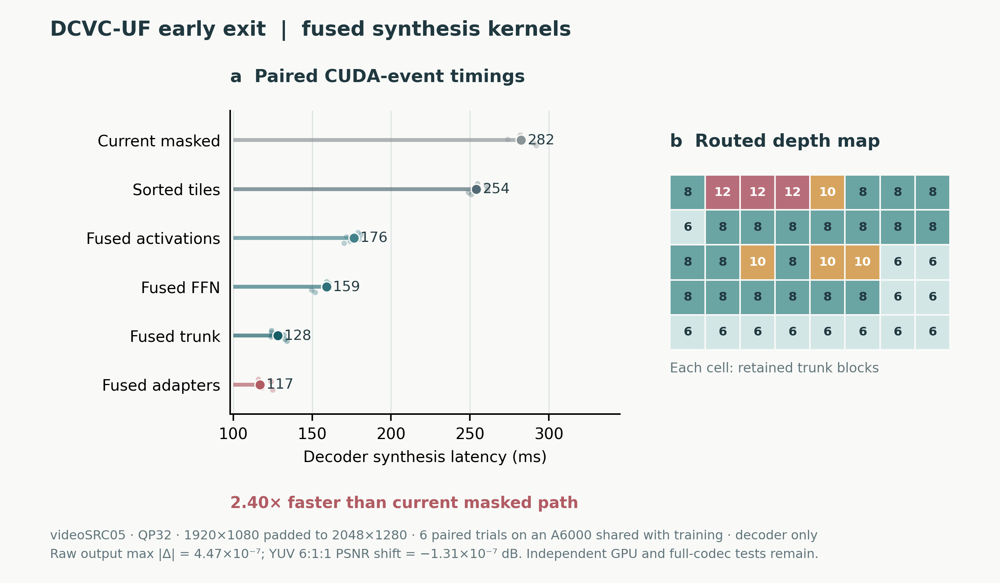

# DCVC-UF early-exit CUDA/Triton inference hızlandırması

**Durum, 2 Ekim 2026:** e15 checkpoint'inin var olan patch-adaptive decoder'ı için eğitim kodundan ayrılmış, isteğe bağlı bir Triton inference yolu çalışıyor. Gerçek CTC ilk karesi `videoSRC05`, QP32, arşivlenmiş **gerçek router haritası** ve 1920×1080 → 2048×1280 padding ile decoder sentezi medyanı **282 ms'den 117 ms'ye** indi. Altı karışık-sıralı eşlenik denemede medyan hız oranı **2,40×**. Bu GPU, D12 eğitimiyle paylaşıldığından sayı *keşif benchmarkı*dır; bağımsız GPU'da yeniden ölçülmeden makaleye nihai hız iddiası olarak yazılmamalı. Bu sonuç encoder, entropi çözme, router ve bitstream map ayrıştırmayı içermez.



[Vektör figür](latency_map.pdf) · [Ham eşlenik zamanlar](../../../results/triton_early_exit_paired_videoSRC05_qp32.json) · [Beş durumluk kalite denetimi](../../../results/triton_early_exit_quality_audit.json)

## Ne değişti?

Microsoft DCVC-UF `DepthConvBlock` içindeki 1×1 noktasal kanallandırma hesabı baskın. Stock FFN, C→4C genişleme çıktısını belleğe yazar; `sigmoid(4x)·x` ve dört interleaved kanalı toplama işlemleri ayrı kernel'lere dönüşür. Opt-in yol üç seviyede füzyon yapıyor:

1. `WSiLU` ve `WSiLUChunkAdd` için tek geçişli Triton kernel'leri.
2. FFN'in ilk 1×1 genişletmesi + aktivasyon + dört kanallı indirgemesi için `tl.dot(..., input_precision='tf32x3')` ve yalnız C kanallı çıktı. İkinci 1×1 projeksiyon residual toplamıyla aynı kernel'de.
3. Her 384-kanallı trunk bloğunda ilk 1×1 + WSiLU ve üçüncü 1×1 + residual toplamı ayrıca birleşik. FFN ve 1×1 early-exit adapter'ları da aynı parçaları kullanıyor.

Ek olarak aynı noktasal epilog, 384→192 kanallı RGB başındaki blok ve ortak upsample bloğuna uygulandı. Sarmalayıcılar mevcut `eval()` durumunu devralıyor; bu, sonradan eklenen PyTorch modüllerinin varsayılan eğitim moduna dönmesini önler. Eğitim moduna tekrar geçirilirse stock yol çalışır.

Hızlı yolun profilinde FFN ve diğer noktasal matris çarpımları baskın kaldı. 3×3 depthwise için sıfır ve replicate padding destekleyen ikinci bir Triton kernel'i eklendi; replicate, e15 checkpoint'inin gerçek tile ayarıdır. Paylaşılan GPU'daki kısa mikro ölçümde 16×16 tile için PyTorch/Triton medyanları sıfır padding'de **0,089/0,050 ms**, replicate padding'de **0,165/0,050 ms** oldu. Ağırlıkları önceden transpoze etme denemesi FFN'de en fazla yaklaşık %4,5, büyük ortak haritada %0,7 iyileşme verdi; ek paketleme maliyeti için yetersiz olduğundan ürün yoluna alınmadı. [Depthwise ham mikro kayıt](../../../results/triton_depthwise_micro_shared.json) · [Ağırlık düzeni denemesi](../../../results/triton_weight_layout_shared.json).

Tile'ları derinliğe göre sıralayan var olan yol opt-in olarak açılıyor; aynı tile'lar aynı ağırlıklardan geçiyor. Mode-map CPU'da ayrıştırılıyorsa [host-planned yürütme](../../../flexuf/kernels/planned_decoder.py) ayrıca mevcut; küçük/yoğun haritalarda etkisi birkaç ms ve bu aşamanın ana hız kazanımı değil. Kerneller A6000/SM86 float32 NCHW yolunda denenmiş; autograd, CPU, half ve desteklenmeyen yerleşimlerde stock PyTorch yoluna düşer. Opt-in API `enable_fast_inference(net.dec)` yalnız **checkpoint yüklenip `eval()` çağrıldıktan sonra** kullanılmalı. Bu dönüşüm inference modül ağacını değiştirir; dönüştürülmüş modülün `state_dict`'i eğitim checkpoint'i olarak saklanmamalı.

## Eşlenik 1080p aşama ölçümü

`videoSRC05`, QP32, 40 tile, harita histogramı D6/D8/D10/D12 = **13/20/4/3**. Aynı latent, QP, ağırlıklar ve harita; TF32 kapalı. Her deneme bloğunda yürütme sırası karıştırıldı ve her kol aynı blokta bir kez çalıştırıldı. CUDA event medyanları:

| Decoder sentezi | Medyan (ms) | Önceki aşamaya göre |
|:--|--:|:--|
| Mevcut maskeli yol | 282,3 | Referans |
| Sıralı tile yürütmesi | 254,0 | Masked ile bit-exact |
| + Birleşik aktivasyonlar | 176,5 | Daha az launch ve 4C ara tensör |
| + Birleşik FFN ilk projeksiyonu | 159,3 | `tf32x3` GEMM |
| + Birleşik trunk blokları | 128,2 | 1×1/aktivasyon ve residual füzyonu |
| + Birleşik early-exit adapter'ları | **117,0** | **Mevcut yola göre 2,40× eşlenik medyan** |

Sayılar tek GPU üzerinde aynı zaman aralığında alınmış; GPU'daki D12 eğitimi çalışma yükü ve frekansı değiştirebilir. Bu yüzden ham kayıtlar korunuyor; 282,3/117,0 bölümü ile eşlenik oran medyanının küçük farkı doğal. İlk adayın kullanıldığı beş CTC/QP durumunda kaliteyi ayrıca denetledik, ancak son adapter füzyonunun **performans zamanlaması yalnız bu bir CTC/QP işletim noktasında** yapıldı. Başka QP'lere 2,40× genellemesi yapılmamalı.

Aynı CTC/haritada tek geçişli PyTorch aktif ayırıcı tepe belleği denetimi, mevcut maskeli yol için **1.070 MB**, opt-in hızlı yol için **692 MB** ek tepe ayırımı gösterdi (**%35,3 daha az**). Bunlar model/latent zaten bellekteyken decode sırasında eklenen aktif tensor baytlarıdır; CUDA rezervasyonu, başka süreçlerin VRAM'i ve cuDNN'in PyTorch dışı belleği değildir. [Ham bellek kaydı](../../../results/triton_early_exit_peak_memory.json).

## Çıktı doğruluğu

Beş CTC ilk-kare/gerçek arşiv haritası: `videoSRC05` QP 0/32/63, `videoSRC01` QP32 (tümü D6), `videoSRC10` QP32 (D10/D12 ağırlıklı). TF32 kapalı, Microsoft'un YUV 6:1:1 PSNR hesabı ve kaynağın gerçek 4:2:0 düzlemleri kullanıldı. Stock maskeli decoder'a göre en büyük ham örnek farkı **6,26×10⁻⁷**, en büyük mutlak YUV PSNR farkı **1,31×10⁻⁷ dB**. Sıralama ve CPU plan yolu tek başına bit-exact; `tl.dot(tf32x3)` füzyonundan sonra tüm çıktı bit-exact **değil**, ama ölçülen fark FP32 yuvarlama düzeyinde. [Ham sonuç](../../../results/triton_early_exit_quality_audit.json).

Kod düzeyinde **38 hedefli test** geçti: şekil, dtype/CPU/autograd fallback, installer idempotence, karışık haritanın tam rekonstrüksiyon eşitliği, noktasal/trunk/adapter/baş/depthwise füzyonları ve kohort özetinin kapsam koşulları. Canlı D6/D8/D10/D12 eğitim dosyaları, supervisor süreçleri ve checkpoint'leri değiştirilmedi. Kısa GPU testleri D12'nin anlık adım süresini geçici artırdı; kontrol sonrası normal pencere hızına döndü. Daha uzun GPU zamanlamasını eğitim sürerken durdurduk.

Baş füzyonlu sürümün **aynı** `videoSRC05`, QP32, 1080p/2048×1280, 40-tile haritasında kısa paylaşılan-GPU tekrarı stock **286,1 ms**, hızlı **115,1 ms**, eşlenik medyan **2,46×** verdi. Çıktı farkı en çok 4,47×10⁻⁷, YUV farkı −2,11×10⁻⁷ dB. Önceki 117,0 ms ile 115,1 ms arasındaki küçük fark bu paylaşılan GPU'da güvenilir ek-kazanç kanıtı sayılmamalı; yalnız tam sistemin doğru çalıştığını gösterir. [Ham kayıt](../../../results/triton_ctc_src05_qp32_boundary_shared.jsonl). Farklı bir CTC dizisinin QP0 ve tamamen D6 haritasında kısa smoke testi **206,7 → 99,8 ms** verdi; yalnız iki zaman tekrarı içerir ve genelleme amacı taşımaz. [Ham kayıt](../../../results/triton_ctc_cohort_shared_smoke.jsonl).

Depthwise eklenmiş son sürümde **aynı** `videoSRC05`/QP32 haritası için kısa tekrarda **287,2 → 112,1 ms**, eşlenik medyan **2,56×** görüldü. Bu da D12 ile paylaşılan GPU'da dört eşlenik tekrarın sonucudur; bağımsız GPU'da koşul doğrulanmadan önceki sürümle arasındaki yaklaşık 3 ms'yi kesin fark saymıyoruz. [Ham kayıt](../../../results/triton_ctc_src05_qp32_depthwise_shared.jsonl). Beş farklı gerçek CTC/QP ve harita durumunda son sürümün stock'a göre en büyük ham örnek farkı **6,26×10⁻⁷**, en büyük mutlak YUV 6:1:1 PSNR farkı **2,11×10⁻⁷ dB**. [Son kalite denetimi](../../../results/triton_early_exit_quality_depthwise_audit.json).

## Çalıştırma ve kalan doğrulama

```python
net.eval()
from flexuf.kernels import enable_fast_inference
enable_fast_inference(net.dec)  # checkpoint yüklemesinden sonra; opt-in
with torch.inference_mode():
    rgb = net.dec(y_hat, q_dec, exit_map=mode_map_cuda)
```

Yeniden üretim: `CUDA_VISIBLE_DEVICES=<boş GPU> .venv/bin/python scripts/benchmark_triton_paired.py --gpu 0 --ctc-seq videoSRC05_1920x1080_25.yuv --qp 32 --blocks 20`; kalite denetimi: `scripts/audit_triton_early_exit_quality.py`. **53 CTC × 5 QP kohort koşucusu** `scripts/benchmark_triton_ctc_cohort.py` ile hazır: `--dry-run` kapsamı kontrol eder, varsayılan başlatma hedef GPU'da başka compute süreci varsa reddedilir, `--resume` yarım kalmış JSONL dosyasından sürdürür. Her dizinin ilk karesi ve arşivlenmiş kaynak-kalibrasyonlu haritası kullanılır; arşivde haritası olmayan iki durumda en derin yoğun çıkış seçimi açıkça işaretlenir. Hem CUDA event hem host duvar zamanı kaydedilir. `scripts/summarize_triton_ctc_cohort.py` ancak 53×5 tamamlandığında normal özet çıkarır; dizi-kümeli bootstrap belirsizliği ve QP kesitleri verir. Kohort **henüz çalıştırılmadı**; aktif eğitimler bittikten sonra boş GPU'da çalıştırılmalı. Sonrasında **gerçek bitstream'den map ayrıştırma + latent entropy decode + router maliyeti dahil uçtan uca decode** zamanını ölçmek gerekiyor. Makaleye konacak hız rakamı bu bağımsız protokolden gelmeli.
