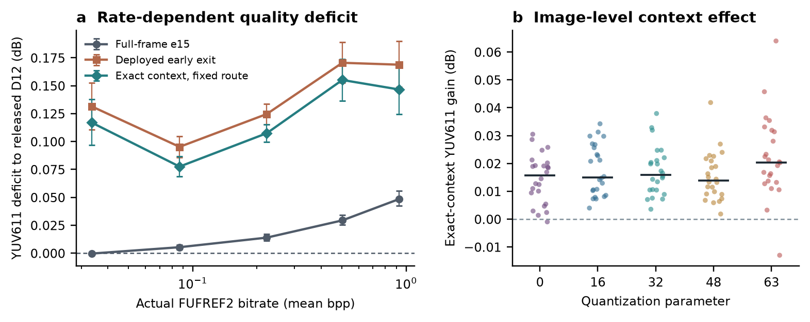

# Kodak24 exact-context transfer

This is a CPU-only replay of **120 existing real FUFREF2 bitstreams**:
Kodak24 x QP 0/16/32/48/63. The beta policy was fitted on DIV2K calibration
and remained frozen for Kodak. The Microsoft released analysis/entropy path
and epoch-15 shared early-exit synthesis checkpoint are unchanged. For each
stream the script recomputes the frozen exit map from the archived router
log-probabilities, verifies it against the earlier Kodak transfer record,
then reconstructs both the deployed zero-halo-plus-repair output and the
diagnostic clipped exact-context/no-repair output. The existing source PNG,
stream, scan, transfer, policy, and checkpoint hashes are checked.

Kodak images include both 768 x 512 and 512 x 768 orientations. The ideal
shared-context feature-cell union is computed on the actual 2 x 3 or
3 x 2 tile grid. This **ideal arithmetic** assumes perfect sharing and
zero scheduling overhead; it is not decoder latency or a sparse kernel.

Two quality comparisons are reported separately:

- `Delta444`: 10log10(MSE_variant/MSE_e15_full) in centred YCbCr444;
  this isolates the early-exit synthesis change on a fixed bitstream.
- `YUV611 gap`: released D12 decoder YUV611 PSNR minus variant YUV611 PSNR;
  this answers how far the variant lies behind released reconstruction.

Kodak was examined earlier in this project, so this is an external-dataset
diagnosis, **not an untouched prospective holdout**. No codec latency,
BD-rate, or adaptive router deployment is inferred from these CPU runs.

## Results

All **120/120** real-stream replays completed, with archived deployed
Delta444 and YUV611 cross-checks passing. Across Kodak24 x five QPs, mean
released / deployed / exact-context YUV611 PSNR is **35.0261 / 34.8879 /
34.9053 dB**. Exact context therefore recovers **0.01740 dB YUV611**
(24-image paired cluster-bootstrap 95% interval **[0.01405, 0.02090] dB**),
reducing the mean gap to released from **0.13816 to 0.12076 dB**. The
corresponding e15-full Delta444 drops from **0.09763 to 0.08275 dB**;
cases over 0.1 dB drop from **47/120 to 34/120**. The ideal shared-context
arithmetic saving averages **26.30% synthesis MAC**, but this is not an
executed sparse decoder or latency speedup.
An additional full-frame e15 replay decomposes the original 0.13816 dB
gap into **0.01937 dB checkpoint**, **0.10140 dB fixed route**, and
**0.01740 dB context/repair** contributions; see
[the gap decomposition](KODAK_GAP_DECOMPOSITION.md). Thus depth allocation
dominates the released quality shortfall on this cohort.

| QP | Actual stream bpp | Deployed / exact YUV611 gap to released (dB) | Delta444 >0.1 dB deployed / exact | Ideal shared MAC saving |
|---:|---:|---:|---:|---:|
| 0 | 0.0336 | 0.1315 / 0.1170 | 9 / 7 | 35.70% |
| 16 | 0.0867 | 0.0952 / 0.0776 | 1 / 0 | 26.15% |
| 32 | 0.2221 | 0.1246 / 0.1074 | 5 / 2 | 26.04% |
| 48 | 0.5025 | 0.1706 / 0.1552 | 17 / 14 | 25.70% |
| 63 | 0.9275 | 0.1689 / 0.1466 | 15 / 11 | 17.90% |

The gain is positive in 118 of 120 image/QP YUV611 comparisons; the two
negative cases are kodim02/QP63 (-0.0130 dB) and kodim10/QP0 (-0.0010 dB).
Thus exact context has a consistent average benefit but is not safe as a
global per-case improvement guarantee. Most of the released gap remains,
and the diagnostic variant still has 34 cases above the 0.1 dB e15-full
Delta444 threshold. Fixed route choices and checkpoint differences cannot
be repaired by changing tile context alone.

The left panel plots **actual bitstream bitrate** against the PSNR *deficit*
to released D12 for full-frame e15, exact-context routing, and deployed
routing, with image-cluster bootstrap intervals. It is intentionally
not labelled BD-rate: no matched-quality interpolation or sparse runtime
experiment has been performed for the exact-context variant.

## Reproduce

Run `proof/cpu_early_exit/audit_exact_context_kodak.py` with the pinned
released/e15 checkpoints and entropy extension, `CUDA_VISIBLE_DEVICES=''`,
one CPU thread, and low process priority. Its output is resumable by case
and cross-checks the existing `proof/cpu_early_exit/results/kodak24_qp5/`
scan and `/tmp/flexplus-div2k-beta-kodak/` transfer archives. The model
training jobs are not loaded or modified.
