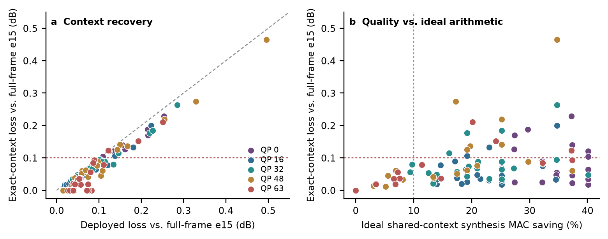

# Exact-context validation of the frozen early-exit router

## Question and protocol

The original decoder processes tiles independently after the shared synthesis
stem, then applies a learned seam-repair pass. This creates a quality floor even
when every tile selects the deepest exit. We ask whether supplying each tile
the *sufficient* feature context removes that floor while preserving a useful
early-exit route. The experiment uses the already locked QP-specific beta
policy and real FUFREF2 bitstreams; it does **not** retrain the router or
change its decisions.

The input set is the first 24 images of the manifest's SHA256-ordered DIV2K
validation split, each at QP 0, 16, 32, 48, and 63. Those 24 images are
disjoint from the 24-image beta-fitting split. Each original PNG supplies a
deterministic centred 768 x 512 crop. Microsoft released analysis and entropy
produce the bitstream; the frozen epoch-15 shared early-exit synthesis
checkpoint produces both the routed image and the full-frame reference.
Quality is `10 log10(MSE_routed / MSE_e15_full)` in centred YCbCr444. It is
neither released-decoder YUV611 PSNR nor a full-codec RD result.

For each selected exit, the counterfactual expands the tile's feature window
by one cell per depthwise 3 x 3 block remaining to that exit, clipped to the
actual image boundary. It runs the stock suffix blocks and pointwise exit
adapter on this window, then pastes the tile core into a shared canvas before
the existing synthesis head. The original seam repair is disabled, so the
comparison changes both context availability and use of learned repair. A
uniform all-deep route is numerically identical to full-frame e15 on the
previous 0828 five-QP control; this validates receptive-field sufficiency.
The routed path is checked against the existing cached deployed quality for
every case (tolerance 0.001 dB), with SHA256 checks for input, stream, policy,
and checkpoint.

The companion ideal shared-context MAC estimate charges each necessary suffix
feature cell once across overlapping tile windows and assumes zero sparse
scheduling, packing, and memory overhead. It is an **optimistic arithmetic
bound** and not a measured implementation or speedup.

## Fixed-prefix diagnostic pilot

The first six validation images (30 image/QP cases) yield mean deployed
Delta444 of 0.1389 dB and mean exact-context Delta444 of 0.1067 dB, an
average 0.0322 dB recovery. Cases exceeding 0.1 dB fall from 17/30 to
13/30. Nine cases have both exact-context loss at most 0.1 dB and at least
10% *ideal* shared-context MAC saving; mean ideal saving over all 30 cases
is 19.81%. These figures are descriptive, not a population estimate.

## Full validation result

The full fixed validation cohort has 24 images x 5 QPs = 120 cases. Mean
Delta444 falls from **0.08888 dB** (deployed zero-halo plus repair) to
**0.06812 dB** (exact clipped context without repair). The paired mean
recovery is **0.02077 dB**, with a 24-image cluster-bootstrap 95% interval of
**[0.01548, 0.02659] dB** (10,000 resamples; all five QPs remain grouped
within an image). This interval describes uncertainty across images in this
fixed DIV2K split; it does not cover new datasets or decoder variants.

The separate 24-image beta-fitting calibration partition was also
reconstructed with the locked policy as a consistency check: mean loss falls
from 0.08512 to 0.06414 dB, a 0.02098 dB mean recovery; violations fall
from 34/120 to 24/120. The calibration set is **not** an independent test,
but the similar magnitude supports the mechanism measurement and reproduces
the earlier five-QP 0828 outlier audit within the new bulk script.

The count over 0.1 dB falls from **35/120 to 24/120**: 11 cases cross below
the threshold, none cross above it, and 24 persist above it. Two cases show a
small numerical degradation despite remaining on their original side of the
threshold: 0839/QP63 is 0.08951 to 0.09301 dB, and 0827/QP63 is 0.12182 to
0.12330 dB. This is consistent with the old learned repair sometimes helping;
the exact variant is not uniformly better.

| QP | Mean deployed / exact Delta444 (dB) | >0.1 dB deployed / exact | Mean **ideal** shared MAC saving |
|---:|---:|---:|---:|
| 0 | 0.0891 / 0.0762 | 8 / 7 | 33.45% |
| 16 | 0.0714 / 0.0555 | 6 / 3 | 22.82% |
| 32 | 0.0955 / 0.0784 | 8 / 4 | 21.18% |
| 48 | 0.1118 / 0.0895 | 9 / 7 | 16.30% |
| 63 | 0.0766 / 0.0410 | 4 / 3 | 9.00% |

The existing ideal shared-context mask analysis predicts **20.55% mean
synthesis MAC saving** on these same frozen maps if each needed suffix
feature cell were computed exactly once with zero overhead. There are
**67/120 cases** with both exact-context loss at most 0.1 dB and at least
10% ideal saving. This is a *feasibility ceiling*: neither an actual sparse
kernel nor end-to-end codec latency was measured. An exact per-tile window
implementation recomputes overlaps and can be slower than full-frame
synthesis; the ideal union estimate must not be attributed to that code.

The remaining 24 violations identify the next research target. Image
0844/QP48 retains 0.465 dB loss with the shallow map [2,2,2,2,3,3]; its
deployed loss was 0.496 dB. Image 0803/QP48 remains at 0.220 dB with
[3,3,3,3,3,3]. Context repairs the tiled floor but cannot add missing
decoder capacity. A future policy would need decoder-visible risk prediction
and targeted depth changes, validated on a fresh split; the current
route-only risk predictor did not give sufficient held-out discrimination.

## Source-informed depth fallback bound

As a diagnostic upper bound, for each of the 24 remaining violations we
reconstructed the same real bitstream with every tile raised by one exit
group, then by two only if needed. This uses the source image to decide when
to stop and **cannot be deployed as a decoder policy**. Twenty-two of the 24
cases cross below 0.1 dB after one uniform increment; only 0844/QP32 and
0844/QP48 need two. None needs all-deep. Applied only to these 24 failures,
the hypothetical cohort mean ideal shared-context saving is **17.89%** with
zero threshold violations. For comparison, switching those failures to
all-deep would leave **14.96%** ideal mean saving, while retaining the
original route on all cases gives **20.55%** ideal saving and 24 violations.
These are analytical MAC bounds, not implemented sparse runtime or a router
result. They show that a targeted depth fallback has more arithmetic headroom
than an all-deep fallback, but the router still needs a reliable
decoder-visible risk signal and a new held-out evaluation.

## Reproduce

Run the CPU-only script `proof/cpu_early_exit/audit_exact_context_pilot.py`
with `--images 24 --output proof/cpu_early_exit/results/div2k_beta/quality_floor/exact_context_validation24.json`,
using the previously captured bitstreams and the pinned upstream/extension
paths. The experiment is resumable by case. Then run
`summarize_exact_context_pilot.py` on its JSON output. Set
`CUDA_VISIBLE_DEVICES=''`, `OMP_NUM_THREADS=1`, and `MKL_NUM_THREADS=1`;
run with a low process priority while the official D8/D10/D12 trainings
continue untouched.

For the diagnostic bound, run `audit_uniform_depth_oracle.py` against the
completed 120-case JSON, then `summarize_uniform_depth_oracle.py`. This
explicitly consumes source-image error and must not be used as an inference
policy or as an unbiased new validation result.
